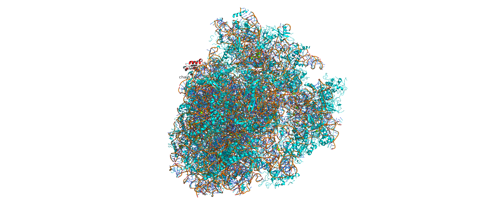
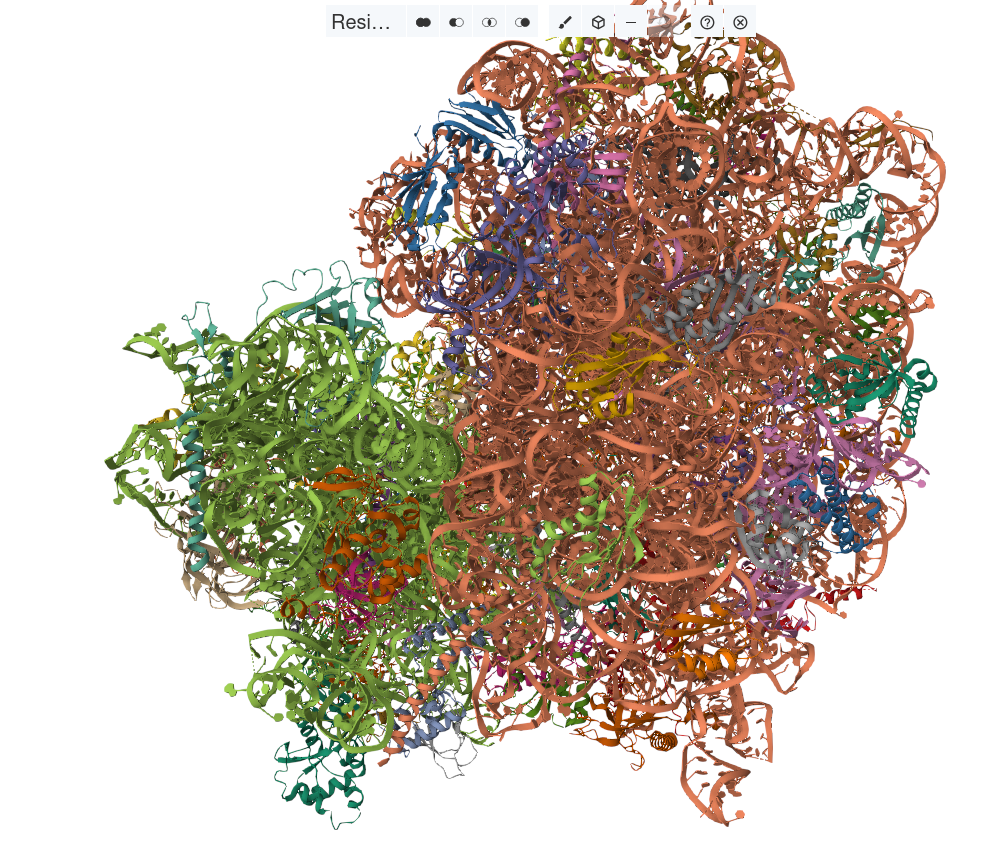

<style type="text/css">
body, td {
font-size: 16px;
}
code.r{
font-size: 16px;
}
pre {
font-size: 16px
}
body .main-container {
max-width: 1600px;
}
</style>

```{r options, include=FALSE}
library(hpgltools)
library(dplyr)
library(enrichplot)
library(ggplot2)
library(ggrepel)
library(gprofiler2)
tt <- try(devtools::load_all("~/hpgltools"))
knitr::opts_knit$set(
  progress = TRUE, verbose = TRUE, width = 90, echo = TRUE)
knitr::opts_chunk$set(
  error = TRUE, fig.width = 8, fig.height = 8, fig.retina = 2,
  out.width = "100%", dev = "png",
  dev.args = list(png = list(type = "cairo-png")))
old_options <- options(digits = 4, stringsAsFactors = FALSE, knitr.duplicate.label = "allow")
ggplot2::theme_set(ggplot2::theme_bw(base_size = 12))
ver <- "202408"
previous_file <- ""
ver <- format(Sys.Date(), "%Y%m%d")

##tmp <- sm(loadme(filename=paste0(gsub(pattern="\\.Rmd", replace="", x=previous_file), "-v", ver, ".rda.xz")))
rmd_file <- "iprgc_analyses_202408.Rmd"
savefile <- gsub(pattern = "\\.Rmd", replace = "\\.rda\\.xz", x = rmd_file)
## No one will ever read this I suspect, but there will _never_ be a word produced
## by an LLM in a document written by me.
```

# TODOs

* Check this for correctness.
* Reorganize it
* GSVA (@hanzelmannGSVAGeneSet2013a)
* Consider embedding some/many/all of the Excel outputs into the html
  output via xfun::embed_dir('excel/')

# Meeting with Theresa

Previous papers did not do an explicit subtraction, instead just
compared to WT and kept the genes which are > in delta/het vs. wt.
There are multiple ways to deal with this and that query has not yet
been defined.  Later, Theresa came to the conclusion that the
subtraction method is not appropriate.

# Introduction

In this document I hope to explore the freshly processed samples and
perform some comparisons to see that we have the expected similarities
and differences from the prior analysis performed by Theresa.

There is one way in which I expect any/all of these analyses to be
explicitly different: this should include the changes produced by
April's renaming of some samples.

My intention is to produce a sample sheet which includes one column
with non-umi-deduplicated results and one with deduplicated results.
With the exception of the previous point, I hope that the first will
be identical (or at least very close to identical) to Theresa's result
while the second I expect will be subtly different -- but I am hoping
subtly enough that it will not significantly change the interpretation
but be a little more precise.

Lets see!  I need therefore to make a change to my metadata gathering
function to include the umi deduplicated result.  I am thinking
therefore to create a separate specification for umi-barcoded samples
because looking through the logs for umi stuff when they are not used
will be too much of a pain...

## Small random reminder

I have a couple pictures of RPL22 to help me remember the experimental
design:

* The human ribosome with RPL22 in red: 
* The mouse ribosome with RPL22 in green at the center:


That second picture came from: (@liMaleGermcellspecificRibosome2022)

# A note about implementation

I would like to improve this document by comparing/contrasting the
methodologies performed by other groups and those performed by me in
it.  I never fully appreciated the suite of computational methods
applied by previous groups when examining TRAP data; I instead simply
followed Theresa's notebook without considering other possibilities.

I therefore spent a little time stepping through her thesis and
pulling out the relevant papers in the hopes of learning these various
methods.  I should therefore be able soon to compare/contrast the
various methods employed by other labs in addition to copying
Theresa's logic.

## The following block cannot work in the container

The following block assumes the full tree of preprocessed data with
the logs from the trimmer, mapping, umi deduplication, counting, etc.
As a result it cannot work in the container which has only the various
count tables.

As a result, I am including a copy of this sheet after running the
following block in my working tree.  I suppose for the moment you will
have to trust that it worked.  (for right now, when testing out this
container, I am just sending the R working directory to my tree for
this block, then moving it back.

I will need to manually edit one column though, the symlink column
from Theresa has a series of paths which do not work in the container.


```{r, eval=FALSE}
umi_spec <- make_rnaseq_spec(umi = TRUE)
iprgc_2022_meta <- gather_preprocessing_metadata("sample_sheets/20240606_only_umd_sequenced.xlsx",
                                                 spec = umi_spec, species = "mm39_112", verbose = FALSE,
                                                 basedir = "preprocessing/umd_sequenced")
colnames(iprgc_2022_meta[["new_meta"]])
head(iprgc_2022_meta[["new_meta"]])
```

```{r}
sample_sheet <- "sample_sheets/20240606_only_umd_sequenced_modified.xlsx"
```

From this point on, I am hoping/intending to pull liberally from
Theresa's notebook with a diversion to compare the three datasets:

* Pre-April renaming: E.g. Theresa's current dataset
* Post renaming: Unless I am mistaken, this should be very similar to
  the above.
* Post deduplication: Given what I saw from the extracted logs in the
  sample sheet, I expect this to be similar but not identical to the
  previous two.

Lets find out!   But first, annotations!

# Annotation data

I am pulling this from Theresa's anxontrapR_pipeline.Rmd, primarily
because it looks similar to the other documents, but was modified more
recently.  I will change it slightly, primarily because I grabbed a
new mmusculus assembly and therefore I will pull the mmusculus
annotations from a specific biomart
(@smedleyBioMartBiologicalQueries2009) archive that should match it.

A note from the future: multiple ensembl archive servers have been
taken offline since last I ran this.  Let us see if Feb. 2023 still
works.

## An important note!

In the recent past, ensembl queries have become inconsistent, failing
much more often than ever in the past.  I do not think this is the
fault of ensembl; but I think I need a fallback mechanism for
collecting annotation information.

In the case of ensembl, it should be trivial (but less fun) to use a
combination of the locally installed orgdb and txdb databases.

This does open a risk that the set of genes with annotations will be
different depending on when the container is run due to differences
between the orgdb/txdb instance and the Feb 2023 biomart.  I am not
sure there is much I can do about that except to bundle the set of
annotations I downloaded in the container -- since
load_biomart_annotations() does save a rda copy of its download.

ok, I did both.  If you, dear reader, wish to download your own
annotations, and ensembl is having troubles, the following should work
without a problem; in addition the rda annotations are in /data of the
container and should get loaded.

```{r}
tx_gene_map <- data.frame()
mm_annot <- try(load_biomart_annotations(species = "mmusculus", year = "2023", month = "02"))
if ("try-error" %in% class(mm_annot)) {
  fields <- c("ACCNUM", "ENSEMBL", "ENSEMBLTRANS", "ENTEZID", "GENENAME", "SYMBOL")
  orgdb_annot <- load_orgdb_annotations("org.Mm.eg.db", fields = fields)
  gene_info <- orgdb_annot[["genes"]]
  ## Note, there are a bunch of variants of the txdb package one might use.
  ## I do not think it matters a lot for our purposes, but I suspect that if we used
  ## a mismatched BSgenome and tried to pull CDS sequences, that might end badly.
  pkg <- "TxDb.Mmusculus.UCSC.mm10.knownGene"
  tx_annot <- load_txdb_annotations(pkg)
  transcripts <- tx_annot[["TX"]]
  transcripts[["tx"]] <- gsub(x = transcripts[["TXNAME"]],
                              pattern = "\\.\\d+$", replacement = "")
  mm_annot <- merge(gene_info, transcripts, by.x = "ensembltrans", by.y = "tx")
  rownames(mm_annot) <- make.names(mm_annot[["ensembl"]], unique = TRUE)
} else {
  mm_annot <- mm_annot[["annotation"]]
  mm_annot[["txid"]] <- paste0(mm_annot[["ensembl_transcript_id"]], ".", mm_annot[["version"]])
  rownames(mm_annot) <- make.names(mm_annot[["ensembl_gene_id"]], unique=TRUE)
  tx_gene_map <- mm_annot[, c("txid", "ensembl_gene_id")]
}
```

# Hisat2 summarizedExperiments

The primary difference between my block and Theresa's are:

1.  I am pulling the metadata directly from the
    gather_preprocessing_metadata() above.
2.  I am using the column 'symlink' which is just a copy of the
    existing 'file' column with a small change so I can load it from
    my directory without having to copy everything.
3.  I am using the ensembl genome release 39, version 112 and so
    pulled a somewhat newer copy of the annotation data.
4.  The original is named 'v1', followed by 'v2' and 'v3' for the
    other two treatments I performed.

## Color choices and reused parameters

Given that we are excluding a bunch of the older samples, the set of
colors I expect to find is different; so I will make explicit here the
various colors used to denote location/genotype/time/etc.

April turned me onto this website 'paletton.com' for this kind of
stuff and I will try and pick out palettes which basically match what
I am getting with the original colors.

```{r}
color_choices <- list(
  "all" = list(
    "p08_het_dlgn" = "#E7298A",
    "p15_het_dlgn" = "#E7298A",
    "p08_het_retina" = "#238B45",
    "p15_het_retina" = "#238B45",
    "p08_het_scn" = "#4292C6",
    "p15_het_scn" = "#4292C6",
    "p08_ko_dlgn" = "#C994C7",
    "p15_ko_dlgn" = "#C994C7",
    "p08_ko_retina" = "#74c476",
    "p15_ko_retina" = "#74c476",
    "p08_ko_scn" = "#9BCAE1",
    "p15_ko_scn" = "#9BCAE1",
    "p08_wt_dlgn" = "#980043",
    "p15_wt_dlgn" = "#980043",
    "p08_wt_retina" = "#004008",
    "p15_wt_retina" = "#004008",
    "p08_wt_scn" = "#08519C",
    "p15_wt_scn" = "#08519C",
    "p60_wt_dlgn" = "#333333",
    "p60_wt_retina" = "#222222",
    "p60_wt_scn" = "#111111"),
  "geno_loc" = list(
    "het_dlgn" = "#E7298A",
    "het_retina" = "#238B45",
    "het_scn" = "#4292C6",
    "ko_dlgn" = "#C994C7",
    "ko_retina" = "#74c476",
    "ko_scn" = "#9BCAE1",
    "wt_dlgn" = "#980043",
    "wt_retina" = "#004008",
    "wt_scn" = "#08519C"),
  "location" = list(
    "retina" = "#004008",
    "dlgn" = "#980043",
    "scn" = "#08519C"),
  "genotype" = list(
    "wt" = "#74c476",
    "het" = "#238B45",
    "ko" = "#006D2C"),
  "time" = list(
    "p08" = "#5E104B",
    "p15" = "#4E9231"))
label_column <- "mgi_symbol" ## Set the column used to extract gene symbols rather than ENSG.....
colors <- color_choices[["geno_loc"]]
```

There is one noteworthy sample: iprgc_103, it was effectively replaced
when April renamed the samples and so exists in the v1 data, but not
v2/v3; they instead have the newly named samples which I called
iprgc_123 to iprgc_130.  As a result, I copied the annotations for
iprgc_123 to my column so that there is no discrepency in terms of
genotype/location/time.

## The original count tables

At the moment I have not included the original counts in this
container because we made some changes to the mapping strategy and
also found that a couple samples were mixed up in sequencing; as a
result I documented all of the changes in the sample sheets and
preprocessing documents and excluded the original files.

This is also why some columns in the sample sheet have suffixes like
'adh' and 'atb', those denote from whom the relevant metadata columns
came from.

```{r, eval=FALSE}
mm38_hisat_v1 <- create_se(sample_sheet,
                           gene_info = mm_annot,
                           file_column = "symlink") %>%
  set_conditions(fact = "geno_loc_atb") %>%
  set_batches(fact = "time_atb") %>%
  set_colors(color_choices[["geno_loc"]])
mm38_hisat_v1
```

## Recounted tables and the deduplicated result

In the following I make two more versions of the data, one remapped
with the changes to the sample identities, and one with deduplication
applied.

```{r}
mm38_hisat_v2 <- create_se(sample_sheet, gene_info = mm_annot,
                           file_column = "hisat_count_table") %>%
  set_conditions(fact = "geno_loc_atb") %>%
  set_batches(fact = "time_atb") %>%
  set_colors(color_choices[["geno_loc"]])
mm38_hisat_v2
mm38_hisat_v3 <- create_se(sample_sheet, gene_info = mm_annot,
                           file_column = "umi_dedup_output_count") %>%
  set_conditions(fact = "geno_loc_atb") %>%
  set_batches(fact = "time_atb") %>%
  set_colors(color_choices[["geno_loc"]])
mm38_hisat_v3

all_fact <- paste0(colData(mm38_hisat_v3)[["time_atb"]], "_",
                   colData(mm38_hisat_v3)[["geno_loc_atb"]])
colData(mm38_hisat_v3)[["time_geno_loc"]] <- all_fact
```

Note the end of the previous block, I created a factor out of the
combination of time, genotype, and location.  In a future invocation
of this notebook, I will change the pairwise comparisons to add each
of these three factors to the statistical model instead of this.  The
code to do that is not _quite_ ready yet.

# Non-zero Counts per Sample

Let's look at the number of non-zero genes for all samples versus the
coverage.

As above, this does not get run because I did not copy the count tables.

```{r eval=FALSE}
v1_nonzero <- plot_nonzero(mm38_hisat_v1)
v1_nonzero
```

But these do!

```{r}
plot_legend(mm38_hisat_v2)
v2_nonzero  <- plot_nonzero(mm38_hisat_v2, y_intercept = 0.65)
v2_nonzero
pp(file = "images/nonzero_v2_unfiltered.pdf")
v2_nonzero[["plot"]]
plotted <- dev.off()

v3_nonzero  <- plot_nonzero(mm38_hisat_v3, y_intercept = 0.65)
v3_nonzero
pp(file = "images/nonzero_v3_unfiltered.pdf")
v3_nonzero[["plot"]]
plotted <- dev.off()
```

Oh wow, I did not expect such a profound effect on the cpm values on
the more saturated libraries.  I guess in retrospect I should have?

Also note to self, we are not messing with p60.

## Exclude p60

```{r}
mm38_hisat_v2 <- subset_se(mm38_hisat_v2, subset = "time_atb!='p60'")
mm38_hisat_v3 <- subset_se(mm38_hisat_v3, subset = "time_atb!='p60'")
```

## Replot the nonzero gene plots

```{r}
v2_nonzero_filt <- plot_nonzero(mm38_hisat_v2, plot_labels = FALSE)
pp(file = "images/nonzero_v2_filt.pdf")
v2_nonzero_filt[["plot"]]
plotted <- dev.off()

v3_nonzero_filt <- plot_nonzero(mm38_hisat_v3, plot_labels = FALSE)
pp(file = "images/nonzero_v3_filt.pdf")
v3_nonzero_filt[["plot"]]
plotted <- dev.off()
```

Once again, I do not want to lose the previous code, so here is the v1 invocation

```{r, eval=FALSE}
mm38_hisat_v1 <- subset_se(mm38_hisat_v1, subset = "time_atb!='p60'")
```

# Quick PCA, then return to Theresa's document

```{r}
v2_norm <- normalize(mm38_hisat_v2, transform = "log2", convert = "cpm",
                     norm = "quant", filter = TRUE)
v2_norm_pca <- plot_pca(v2_norm)
v2_norm_pca
pp(file = "images/v2_norm_pca.pdf")
v2_norm_pca[["plot"]]
plotted <- dev.off()

v3_norm <- normalize(mm38_hisat_v3, transform = "log2", convert = "cpm",
                     norm = "quant", filter = TRUE)
v3_norm_pca <- plot_pca(v3_norm)
v3_norm_pca
pp(file = "images/v3_norm_pca.pdf")
v3_norm_pca[["plot"]]
plotted <- dev.off()
```

Ibid.

```{r, eval=FALSE}
v1_norm <- normalize(mm38_hisat_v1, transform = "log2", convert = "cpm",
                     norm = "quant", filter = TRUE)
plot_pca(v1_norm)
```

To my eyes it looks like we just have 1 weirdo p15 sample?
Deduplication had a minor but significant effect on the PCA.

With that in mind, let us look at Theresa's WORKING document and see
what we can recapitulate.

Theresa's document: The TRAP protocol has some variability which is
introduced at different stpdf including homogenization, antibody
labeling, pulldown efficiency/specificity, sample handling during
cleanup stpdf, and library prep/sequencing. We know from Rashmi's QC
that there is variability at the level of pulldown efficiency (amount
of RNA isolated). She is doing a good job of keeping track of this for
all her samples and we have validated her P8 results (attached
supplementary figure 3D). We consistently see clear differences
between control and cre samples for the retina, which makes sense
because the cell bodies are in the retina. The target tissue
differences are smaller, which also makes sense for axon-TRAP. We
think that some of her P15 samples are not good based on low amounts
of isolated RNA from cre(+) retina samples. We plan to drop these
samples and not perform additional isolations at this time
point. Based on this (and the general lack of large developmental
effects), we were planning to focus on presenting the P8 data only in
the paper. Interested to hear your thoughts in this...

My notes: Theresa's first operations in this notebook were to:

1.  Set location as condition, genotype as batch.
2.  Perform PCA before/after sva.

```{r}
v3_loc_geno <- set_conditions(mm38_hisat_v3, fact = "location_atb",
                              colors = color_choices[["location"]]) %>%
  set_batches(fact = "genotype_atb")
```

## The associated PCA

At different times, it appears to me that Theresa has preferred
slightly different normalization methods, primarily a mix of TMM and
quantile.

Thus I will use different suffix letters to denote various
normalizations employed, and if they turn out the same I will pick one arbitrarily.

```{r}
loc_geno_nq <- normalize(v3_loc_geno, transform = "log2", convert = "cpm",
                         filter = TRUE, norm = "quant")
location_genotype_pca <- plot_pca(loc_geno_nq)
pp(file = "images/location_genotype_norm_pca.pdf")
location_genotype_pca[["plot"]]
plotted <- dev.off()
location_genotype_pca
## ok, I have two weirdo samples which look very much like they are actually dlgn.
## These are sample IDs iprgc_66 and iprgc_130

loc_geno_nt <- normalize(v3_loc_geno, transform = "log2", convert = "cpm",
                         filter = TRUE, norm = "tmm")
location_genotype_tmm_pca <- plot_pca(loc_geno_nt)
pp(file = "images/location_genotype_tmm_pca.pdf")
location_genotype_tmm_pca[["plot"]]
plotted <- dev.off()
location_genotype_tmm_pca
```

A random thought about these PCA plots, it might be worth while to add
a panel below the legend with the sample numbers per condition/batch.

Of course, the same information is provided in a more fun fashion via
my silly sankey function:

```{r}
sample_sankey <- plot_meta_sankey(v3_loc_geno, color_choices = color_choices,
                                  factors = c("genotype_atb", "location_atb", "time_atb"))
pp(file = "images/design_sankey.pdf")
sample_sankey[["ggplot"]]
plotted <- dev.off()
sample_sankey
```

# A Short conversation with Rashmi

Rashmi came by and we discussed the samples a little.  She suggested
that is likely that we will need to exclude the 202205 samples, these
may be identified by a few ways, most easily I think via the
'project_ah' column, they are the 021_1 samples.

My sense was that she concurred with my interpretation of the umi
deduplication, so I will continue using the deduplicated results
exclusively, at least for now.

# Melanopsin Sanity Check

One of Theresa's first checks was wisely for melanopsin.  Let us
repeat a version of this:

An important note: Indrajeet Patil removed the groupedstats and its
associated plotting library from CRAN/github/etc.  I am not certain
what happened, but that necessitates a change in how I plot this.

```{r}
opn4_exprs <- data.frame(combined = colData(loc_geno_nt)[["geno_loc_atb"]],
                         location = colData(loc_geno_nt)[["location_atb"]],
                         genotype = colData(loc_geno_nt)[["genotype_atb"]],
                         opn = assay(loc_geno_nt)["ENSMUSG00000021799", ])

## groupedstats::grouped_summary(opn4_exprs, location, opn)
## opn4_location <- ggbetweenstats(data = opn4_exprs, x = location, y = opn)
## pp(file = "images/ggbetween_location.pdf")
## opn4_location
## plotted <- dev.off()
## opn4_location

## opn4_genotype <- ggbetweenstats(data = opn4_exprs, x = genotype, y = opn)
## pp(file = "images/ggbetween_location.pdf")
## opn4_genotype
## plotted <- dev.off()
## opn4_genotype

## opn4_combined <- ggbetweenstats(data = opn4_exprs, x = combined, y = opn)
## pp(file = "images/ggbetween_combined.pdf")
## opn4_combined
## plotted <- dev.off()
## opn4_combined
```

ok, so I plotted the question a bit differently, but got the same
answer.

Here is the text of Theresa's notebook following this analysis:

"Ugh oh, looks like there is at least one retina KO sample that has
some melanopsin expression in it. Turns out ipRGC_07 is a bad egg
which is supposed to be a KO but has melanopsin expression. It’s
friends which were pooled from the same mice are iprgc_06 and
iprgc_08, so we need to exclude all these samples."

I am also seeing some knockout expression with some caveats: I do not
have the affected samples in my dataset (iprgc_07) and the levels I am
seeing are quite low -- I will look in IGV to double check, but I
strongly suspect that these are some piddly reads near the UTRs.

Onward!

# PCA plots

## PCA of all genes by location

Theresa's first pca was of log2 cpm values.  I might add quantile/tmm
to this?

```{r}
v3_location <- set_conditions(mm38_hisat_v3, fact = "location_atb") %>%
  set_batches(fact = "genotype_atb") %>%
  set_colors(color_choices[["location"]])
v3_location_norm <- normalize(v3_location, filter = TRUE, norm = "quant",
                                   transform = "log2", convert = "cpm")
plot_pca(v3_location_norm)
```

Once again we see that samples iprgc_66 and iprgc_130 are likely
actually DLGN and not SCN.  I am therefore going to add a column to
the sample sheet noting this, and remove them from the expressionset.

I will thus replot the data after removing those two.  If we want to
see what it looks like with the re-attributed locations, we can do so.

Theresa has a nice change to the PCA plotter in which she sets the
alpha channel as an additional visual queue for a metadata factor...

```{r}
mm38_hisat_v3 <- subset_se(mm38_hisat_v3, subset="sampleid!='iprgc_130'") %>%
  subset_se(subset="sampleid!='iprgc_66'")
v3_location <- set_conditions(mm38_hisat_v3, fact = "location_atb") %>%
  set_batches(fact = "genotype_atb") %>%
  set_colors(color_choices[["location"]])

v3_location_norm <- normalize(v3_location, filter = TRUE, norm = "quant",
                                   transform = "log2", convert = "cpm")
filtered_location_pca <- plot_pca(v3_location_norm)
pp(file = "images/filtered_location_pca.pdf")
filtered_location_pca[["plot"]]
plotted <- dev.off()
filtered_location_pca

removed_sankey <- plot_meta_sankey(v3_location, color_choices = color_choices,
                                   factors = c("genotype_atb", "location_atb", "time_atb"))
pp(file = "images/filtered_sankey.pdf")
removed_sankey[["ggplot"]]
plotted <- dev.off()
removed_sankey
```

Here is Theresa's text, recall once again that I do not have some of
these older samples (iprgc_62):

PC1 vs PC2 identifies retina vs axon is still the main component of
variation. We do see though that in the PC2 direction, we see with the
new samples added, we don’t see separation based on axonal targets
(dLGN vs SCN). In the PC1 vs PC3 plot, we see that it’s PC3 where we
start to see variation correlated with axonal compartment. Let’s look
at PC1 vs PC2 colored by batch (when they were processed/sequenced) to
see if that is what is contributing so much variation in PC2.

Side note: ipRGC 62 seems like an odd ball. This seems to me like it
should have been a dLGN P08 sample. Is there any possibility this got
mislabeled early on? I went back and double checked to see if all my
processing is correct and it indeed was labeled an SCN P15 from the
time I got the samples, and it is indeed.

# DE

I now switched to Theresa's document 'WORKING_axonTRAP...' and will
start pulling sections from it.  I am reasonably certain I have
reasonably similar sample distributions, so I presume I can invoke
similar/identical calls for DESeq and friends.

## p8 retinas

In the block immediately before the DE analyses, Theresa created a
subset expressionset of only p08 retinas.  Thus this initial DE I
assume will be used to subtract for the SCN/DLGN analyses that follow.
(I guess I could read ahead and find out, but no! I want to be a
blank slate)

Theresa's primary workflow makes heavy use of DESeq2
(@loveModeratedEstimationFold2014) and sva
(@leekSVAPackageRemoving2012).  In some(most?) of Theresa's
invocations of the all_pairwise() function, she excludes the other
methods that it performs.  In this workbook, I left those methods on,
thus we can evaluate the relative performance DESeq2 vs. some (all? I
may have disabled EBSeq/dream because they were taking too long)
of the following:

* limma: (@ritchieLimmaPowersDifferential2015) (among other
  references) originally written for microarrays.
* EdgeR: (@robinsonEdgeRBioconductorPackage2010), which shares many
  assumptions with DESeq2.
* EBSeq: (@lengEBSeqEmpiricalBayes2013), because I have a soft spot
  for any Bayesian method.
* Noiseq: (@tarazonaNOIseqRNAseqDifferential2011), which seeks to
  directly model variance in an RNASeq dataset and use that to improve
  the sensitivity of the result, much like:
* Dream: (@hoffmanDreamPowerfulDifferential2020), written by the same
  authors (and uses very similar logic) as one of my favorite tools,
  variancePartition(@hoffmanVariancePartitionInterpretingDrivers2016).

```{r}
mm38_p8_retina <- subset_se(mm38_hisat_v3, subset = "time_atb=='p08' & location_atb=='retina'")
mm_normal_p8_ret_de <- all_pairwise(mm38_p8_retina, model_svs = "svaseq",
                                    model_fstring = "~ 0 + condition", filter = TRUE)
mm_normal_p8_ret_de
```

The following invocation performed by Theresa filters the wt/het
comparison for only those genes which increased by at least 0.25 logFC
with a significant adjusted p-value.  I assume that this is to use the
wt samples as a translational control for the ket/ko comparisons; I am
therefore thinking that for my purposes, I will therefore separate the
contrasts from all_pairwise do this in a stepwise fashion...

The block of code immediately following Theresa's all_pairwise()
invocation is a little confusing for me and warrants some explanation
by me to me in the hopes that I do not misunderstand what is happening
and the goals therein.

I think I can safely assume that the goal here is to pull out the IDs
which increased in het with respect to wild type; even if by a small
margin, as long as it is statistically significant vis a vis the
adjusted p-value.

I am going to perform what I think is the same thing in a slightly
different fashion so that I can share a copy of the results with
whomever is interested.  I will also repeat Theresa's invocation and
prove to myself that I understood and got the same answer.

```{r}
wt_het_keeper <- list("het_vs_wt" = c("het_retina", "wt_retina"))
het_wt_table <- combine_de_tables(mm_normal_p8_ret_de, keepers = wt_het_keeper,
                                  label_column = label_column,
                                  excel = "excel/het_retina_control.xlsx")
wanted_sig <- extract_significant_genes(het_wt_table,
                                        lfc = 0.25,
                                        according_to = "deseq")
wanted_het_increased <- wanted_sig[["deseq"]][["ups"]][["het_vs_wt"]]
increased_het_genes <- rownames(wanted_het_increased)
```

Here are Theresa's next lines:

```{r}
mm_de_normal_p8_ret <- mm_normal_p8_ret_de
hetkeeper_genes <- mm_de_normal_p8_ret$deseq$all_tables$wt_retina_vs_het_retina %>%
  filter(logFC <= -0.25 & adj.P.Val <= 0.05)
kokeeper_genes <- mm_de_normal_p8_ret$deseq$all_tables$wt_retina_vs_ko_retina %>%
  filter(logFC <= -0.25 & adj.P.Val <= 0.05)
keepergenes <- unique(c(rownames(hetkeeper_genes),
                        rownames(kokeeper_genes)))
## We know a priori that Opn4 is ENSMUSG00000021799
## I do not expect to see it in this set, it should be higher in wt
## retina vs ko retina by a significant margin.
"ENSMUSG00000021799" %in% keepergenes
## Oooohhh but it _is_ higher in het vs. wt, as we saw in
## the violin plot earlier.
```

I think Rashmi made a compelling point which illustrates why we likely
should expect the expression of Opn4 to significantly higher in the
heterozygotes vs wild-type:

1.  Recall that the assay is using the immunopurification to extract
    the RNAs.
2.  The wt samples do not have the cre recombinase and therefore no HA
    and therefore everything we observe is due to non-specific
    binding.
3.  The set of genes observed due to non-specific binding is different
    than het/ko (presumably a larger number of relatively small
    values), therefore the divisor performed in the cpm is likely
    relativly large resulting in normalized values getting shifted
    down to some degree.
4.  On the other hand, the set of genes observed in het/ko are more
    likely to be only the specific binders and therefore smaller (I
    can test this) resulting in a smaller divisor and slight shifting
    up in the cpm values.

This makes me wonder if any normalization methods exist which do
something like multiply the values by some value related to the
proportion of observed genes; and/or if this is a good/bad/indifferent
idea.

Also, just a note for me to remember: RPL22, not RPS22, for some
reason I keep thinking the small subunit.

## Prove I understood

```{r}
hetkeeper_genes <- mm_normal_p8_ret_de$deseq$all_tables$wt_retina_vs_het_retina %>%
  filter(logFC <= -0.25 & adj.P.Val <= 0.05)
testthat::expect_true(nrow(hetkeeper_genes) == length(increased_het_genes))
taa_keepers <- sort(rownames(hetkeeper_genes))
atb_keepers <- sort(increased_het_genes)
testthat::expect_equal(taa_keepers, atb_keepers)
```

Yay! I can read!  Now let us repeat for the KO vs wt

```{r}
wt_ko_keeper <- list("ko_vs_wt" = c("ko_retina", "wt_retina"))
ko_wt_table <- combine_de_tables(mm_normal_p8_ret_de, keepers = wt_ko_keeper,
                                 label_column = label_column,
                                 excel = "excel/ko_retina_control.xlsx")
wanted_sig <- extract_significant_genes(ko_wt_table,
                                        lfc = 0.25,
                                        according_to = "deseq")
wanted_ko_increased <- wanted_sig[["deseq"]][["ups"]][["ko_vs_wt"]]
increased_ko_genes <- rownames(wanted_ko_increased)
```

The next thing performed in Theresa's document is a unique(concatenation of
these two gene groups), thus sucking up every gene which was
significantly higher in either the knockout _or_ heterzyous samples
with respect to wild-type.

This was followed by a couple of merge operations of a little bit of
the annotation data; I am not sure I understand the goal yet...

Here is her code. I copied the annotation 'mgi_symbol' column to
'external_gene_name' so that I need not change any of her code.  I am
assuming this is the appropriate column of interest, I do not know
this for certain, but it seems quite likely.

While I am at it, here is the set_sig_limma() function from Theresa's helpers.R

```{r}
set_sig_limma <- function(limma_tbl, factors = NULL) {
  if (is.null(factors)) {
    #set significance for plotting colors
    limma_tbl$Significance <- NA
    limma_tbl[abs(limma_tbl$logFC) < 1 | limma_tbl$adj.P.Val > .05, "Significance"] <- "Not \nEnriched"
    limma_tbl[limma_tbl$logFC >= 1  & limma_tbl$adj.P.Val <= .05, ][["Significance"]] <- "Disease \nUpregulated"
    limma_tbl[limma_tbl$logFC <= -1  & limma_tbl$adj.P.Val <= .05, ][["Significance"]] <- "Disease \nDownregulated"
    limma_tbl$Significance <- factor(limma_tbl$Significance, levels = c("Upregulated", "Downregulated",  "Not \nEnriched"))
  } else {
    limma_tbl$Significance <- NA
    limma_tbl[abs(limma_tbl$logFC) < 1 | limma_tbl$adj.P.Val > .05, "Significance"] <- "Not \nEnriched"
    if(nrow(limma_tbl[limma_tbl$logFC >= 1  & limma_tbl$adj.P.Val <= .05, ]) != 0) {
      limma_tbl[limma_tbl$logFC >= 1  & limma_tbl$adj.P.Val <= .05, ][["Significance"]] <- factors[1]
    }
    if (nrow(limma_tbl[limma_tbl$logFC <= -1  & limma_tbl$adj.P.Val <= .05, ]) != 0) {
      limma_tbl[limma_tbl$logFC <= -1  & limma_tbl$adj.P.Val <= .05, ][["Significance"]] <- factors[2]
    }
    limma_tbl$Significance <- factor(limma_tbl$Significance, levels = c(factors,  "Not \nEnriched"))
  }
  return(limma_tbl)
}
```

### Combining het/wt and ko/wt

```{r}
mm_annot[["external_gene_name"]] <- mm_annot[["mgi_symbol"]]
keepergenes <- unique(c(rownames(hetkeeper_genes), rownames(kokeeper_genes)))
length(keepergenes)
annots_to_merge <- mm_annot %>%
  select(ensembl_gene_id, external_gene_name) %>%
  filter(ensembl_gene_id %in%
           rownames(mm_de_normal_p8_ret$deseq$all_tables$ko_retina_vs_het_retina)) %>%
  distinct()
mm_de_normal_p8_ret$deseq$all_tables$ko_retina_vs_het_retina <- merge(
  mm_de_normal_p8_ret$deseq$all_tables$ko_retina_vs_het_retina, annots_to_merge,
  by.x = 0, by.y = "ensembl_gene_id", all.x = TRUE)
df <- mm_de_normal_p8_ret$deseq$all_tables$ko_retina_vs_het_retina %>%
  dplyr::mutate(logFC = -logFC) %>%
  set_sig_limma(factors = c("Het Enriched", "KO Enriched"))
```

My version of the above task makes use of the excludes option of
combine_de_tabes.  Given the set of unique gene IDs increased in the
het/ko, I can ask to exlude anything not in that set.  I could also
have more parsimoniously directly excluded any gene ID increased in
the wt samples.  But, Theresa already provided the code to do the
former, so it will be less typing/opportunity for silly mistakes to
just do that.

```{r}
both_increased_genes <- unique(c(increased_het_genes, increased_ko_genes))
## arbitrairly grab all genes from one of my data structures.
all_genes <- rownames(exprs(mm38_hisat_v3))
exclude_idx <- all_genes %in% both_increased_genes
summary(exclude_idx)
exclude_increased_genes <- all_genes[exclude_idx]
retina_keepers <- list(
  "het_vs_wt" = c("het_retina", "wt_retina"),
  "ko_vs_wt" = c("ko_retina", "wt_retina"),
  "ko_vs_het" = c("ko_retina", "het_retina"))
## A reminder to myself: there is also a parameter 'wanted_genes'
## which does effectively the same thing as excludes in this context;
## excludes was originally written to allow flexible, keyword-based
## exclusion.
p8_retina_tables <- combine_de_tables(
  mm_normal_p8_ret_de, keepers = retina_keepers,
  wanted_genes = both_increased_genes, label_column = label_column,
  excel = glue("excel/p8_retina_kept_genes_increased_in_wt_tables-v{ver}.xlsx"))
p8_retina_sig <- extract_significant_genes(
  p8_retina_tables,
  excel = glue("excel/p8_retina_kept_genes_increased_in_wt_sig-v{ver}.xlsx"),
  according_to = "deseq")
opposite_p8_retina_tables <- combine_de_tables(
  mm_normal_p8_ret_de, keepers = retina_keepers,
  excludes = both_increased_genes, label_column = label_column,
  excel = glue("excel/p8_retina_removed_genes_increased_in_wt_tables-v{ver}.xlsx"))
opposite_p8_retina_sig <- extract_significant_genes(
  p8_retina_tables,
  excel = glue("excel/p8_retina_removed_genes_increased_in_wt_sig-v{ver}.xlsx"),
  according_to = "deseq")
```

# Filtering out non-specific genes and examining the results

The following is a copy/paste from Theresa containing the remaining
tasks she performed and will provide the template for implementation
of the final tasks.

This picks up with the lines from her notebook immediately following
the invocation of 'set_sig_limma(factors = c("Het Enriched" ...'.

For all of the remaining blocks I will copy in her code, turn off its
evaluation, run the blocks manually, compare them to her notebook
output, then enable each block as I ensure I understand it.

I will likely therefore introduce some small formatting changes and
add some additional GSEA/enrichment tasks once the non-specific
filtering is complete.

```{r}
df <- df %>%
  filter(Row.names %in% keepergenes)
labels_ups <- df %>%
  filter(adj.P.Val <= 0.05 & abs(logFC) > 1) %>%
  arrange(logFC) %>%
  head(n = 9)
labels_downs <- df %>%
  filter(adj.P.Val <= 0.05 & abs(logFC) > 1) %>%
  arrange(-logFC) %>%
  head(n = 11)
labels <- rbind(labels_ups, labels_downs)
res_tbl <- df
DEplot <- ggplot(res_tbl, aes(x = logFC, y = -log10(adj.P.Val), label = external_gene_name)) +
  geom_point(aes(colour = Significance), size = 4) +
  geom_vline(xintercept = c(-1, 1)) +
  geom_hline(yintercept = -log10(0.05)) +
  theme_classic(base_size = 20) +
  xlab("log2(FC)") +
  ylab("-log10(p-value)") +
  theme(legend.position = "right") +
  scale_color_manual(values = c("#F8766D", "#00BFC4", "Grey")) +
  geom_label_repel(
    data = filter(df,
                  ## c('s5_het_dlgn', 's5_het_ret', 's5_het_scn')),
                  external_gene_name %in% labels$external_gene_name),
    ## nudge_x = -0.5,
    nudge_y = 3, max.overlaps = 15) +
  xlim(c(-3, 6))
pp(file = "images/p08_retina_DE_1312024.pdf")
DEplot
plotted <- dev.off()
DEplot
write_xlsx(df, excel = "excel/retinahet_vs_retinako_WTfiltered.xlsx")
```

## How many ups/downs

```{r}
ko_enriched <- df %>%
  filter(Significance == "KO Enriched")
nrow(ko_enriched)
het_enriched <-  df %>%
  filter(Significance == "Het Enriched")
nrow(het_enriched)
```

## category enrichment/GSEA

```{r}
regulated_genes <- res_tbl %>%
  filter(adj.P.Val <= 0.05) %>%
  arrange(logFC) %>%
  select(Row.names, logFC, adj.P.Val, external_gene_name, Significance) %>%
  filter(abs(logFC) >= 1)
## gsea_result_ko <- gost(query = ko_genes$external_gene_name,
##                        organism = "mmusculus",
##                        evcodes = TRUE,
##                        ordered_query = TRUE)
gsea_result_het <- gost(query = het_enriched$external_gene_name,
                        organism = "mmusculus",
                        evcodes = TRUE,
                        ordered_query = TRUE)
##gsea_result_alldysregulated <- gost(query = alldysregulated_genes$external_gene_name,
##                                    organism = "mmusculus",
##                                    evcodes = TRUE,
##                                    ordered_query = TRUE)
```

I have a function in my package which seeks to make gProfiler queries
a bit more complete and easy.  Let us see how similar the result is...

```{r, eval=FALSE}
rownames(alldysregulated_genes) <- alldysregulated_genes[["Row.names"]]
alldysregulated_genes[["Row.names"]] <- NULL

het_gp <- simple_gprofiler(rownames(alldysregulated_genes),
                           species = "mmusculus",
                           excel = glue("excel/het_gprofiler-v{ver}.xlsx"))
het_gp
enrichplot::dotplot(het_gp[["BP_enrich"]])
gp_pair <- enrichplot::pairwise_termsim(het_gp[["BP_enrich"]])
enrichplot::emapplot(gp_pair)
enrichplot::ssplot(gp_pair)
enrichplot::treeplot(gp_pair)
upsetplot(het_gp[["BP_enrich"]])

enrichplot::dotplot(het_gp[["REAC_enrich"]])
gp_pair <- enrichplot::pairwise_termsim(het_gp[["REAC_enrich"]])
enrichplot::emapplot(gp_pair)
enrichplot::ssplot(gp_pair)
enrichplot::treeplot(gp_pair)
upsetplot(het_gp[["REAC_enrich"]])
```

I make a somewhat arbitrary distinction between the concepts of
over-enrichment analyses and GSEA: the former (as performed by
gprofiler) (@raudvereProfilerWebServer2019) seeks to find groups of
genes overrepresented in GO/reactome/etc.  These groups of genes are
taken exclusively from the top-n/bottom-n genes with respect to
fold-change between conditions of interest; in this case most
different than wt in the p08 retina ko or het samples.

With that in mind, I can invoke a similar function using the full
table of DE results to get what I call the GSEA result using
clusterProfiler (@yuIntroductionBiomedicalKnowledge).  In the
following block I will use the 'all_cprofiler' function on the data
structures named 'p8_retina_tables' and 'opposite_p8_retina_tables' in
order to get these GSEA results for each contrast performed (het/wt,
ko/wt, het/ko).  I will follow that up with 'all_gprofiler' which does
the same, but uses gProfiler's enrichment analyses (it will therefore
include what we just looked at).

```{r}
p08_retina_all_cp <- all_cprofiler(p8_retina_sig, p8_retina_tables, orgdb = "org.Mm.eg.db")
enrichplot::dotplot(p08_retina_all_cp[["ko_vs_het_up"]][["enrich_objects"]][["MF_all"]])
p08_topn_gsea <- plot_topn_gsea(p08_retina_all_cp)
pp(file = "images/gsea_p08_retina_ko_vs_het_top_hit.png")
p08_topn_gsea[["GO_ko_vs_het_up"]][[1]]
plotted <- dev.off()
p08_topn_gsea[["GO_ko_vs_het_up"]][[1]]
p08_topn_gsea[["GO_ko_vs_het_up"]][[2]]
p08_topn_gsea[["GO_ko_vs_het_up"]][[3]]
p08_topn_gsea[["GO_ko_vs_het_up"]][[4]]
p08_topn_gsea[["GO_ko_vs_het_up"]][[5]]
```

```{r}
#gsea_ko <-  gsea_result_ko[["result"]] %>%
#    select(term_name, p_value, term_size, intersection_size, recall, source, intersection) %>%
#    arrange(desc(recall)) %>%
#    head(n = 10)
#  gsea_plots_ko <- ggplot(gsea_ko, aes(x = recall, y = reorder(term_name, recall), fill = p_value)) +
#  geom_bar(stat = "identity")+
#  scale_fill_continuous(low = "blue", high = "red") +
#  theme_bw()+
#  ylab("") +
#  xlab("GSEA Score")
gsea_het <-  gsea_result_het[["result"]] %>%
  select(term_name, p_value, term_size, intersection_size, recall, source, intersection) %>%
  arrange(desc(recall)) %>%
  head(n = 10)
gsea_plots_het <- ggplot(gsea_het, aes(x = recall, y = reorder(term_name, recall), fill = p_value)) +
  geom_bar(stat = "identity") +
  scale_fill_continuous(low = "blue", high = "red") +
  theme_bw() +
  ylab("") +
  xlab("Over Representation Score")
pp(file = "images/GSEA_p08_axontrap_retinahet_upregulated_vs_retinako.pdf")
gsea_plots_het
plotted <- dev.off()
```

```{r, eval=FALSE}
gsea_all <-  gsea_result_alldysregulated[["result"]] %>%
  select(term_name, p_value, term_size, intersection_size, recall, source, intersection) %>%
  arrange(desc(recall)) %>%
  head(n = 10)
gsea_plots_all <- ggplot(gsea_all, aes(x = recall, y = reorder(term_name, recall), fill = p_value)) +
  geom_bar(stat = "identity") +
  scale_fill_continuous(low = "blue", high = "red") +
  theme_bw() +
  ylab("") +
  xlab("Over Representation Score")

pp(file = "images/GSEA_p08_retina_axontrap_alldysregulatedgenes.pdf")
gsea_plots_all
plotted <- dev.off()
```

# SCN Het vs KO

It is only now that I realized we are splitting the data by location
for each set of comparisons.  I think that, left to my own devices, I
would prefer to keep the input data structure intact, perform the
somewhat larger number of contrasts, and then split up the results.
Ideally this will slightly improve the fidelity of the results
returned by DESeq2 and friends.  But, I will run the state of
Theresa's notebook with as few changes as possible first, then add
this.

## PCA

I am going to skip this PCA plot for a couple of reasons: I already
did a superset of it, and the subset Theresa performed is not valid
given the set of samples included in my sample sheet, and figuring out
the actually corresponding subset will take me forever...  In
addition, I want to use my mm38_hisat_v3 for everything...

```{r, eval=FALSE}
mm38_subset <- subset_se(
  mm38_hisat,
  subset = "(batch == '4' | batch == '5' | batch == '6') & time == 'p08' & location == 'scn' | sampleid == 'iprgc_03'")
mm38_norm <- normalize(mm38_subset, filter = TRUE, convert = "cpm",
                            transform = "log2", batch = "svaseq")
mm38_norm <- set_batches(mm38_norm, fact = "location")
mm38_norm <- set_conditions(mm38_norm, fact = "genotype")
pca_norm <- plot_pca(mm38_norm, max_overlaps = 70)
pca_norm$plot
```

Instead I will simplify the subset and see what happens...

```{r}
scn_samples <- subset_se(mm38_hisat_v3,
                           subset = "location_atb == 'scn'") %>%
  set_batches(fact = "location_atb") %>%
  set_conditions(fact = "genotype_atb", colors = color_choices[["genotype"]])
scn_norm <- normalize(scn_samples, filter = TRUE, convert = "cpm",
                           transform = "log2", batch = "svaseq")
scn_norm_pca <- plot_pca(scn_norm)
scn_norm_pca
```

# Library sizes post-deduplication

Theresa's next operation was to perform libsize/nonzero plots.  I
already did the pre/post deduplication nonzero, here is the analagous
libsize.

v2 is pre-deduplication and v3 is post.

```{r}
plot_libsize(mm38_hisat_v2)
post_filter_nonzero <- plot_libsize(mm38_hisat_v3, text = FALSE)
pp(file = "images/post_all_filteres_nonzero.pdf")
post_filter_nonzero[["plot"]]
plotted <- dev.off()
post_filter_nonzero
```

I am a bit concerned about some of these library sizes
post-deduplication.

Let us look at the relationship between reads and duplication, which I
assume will be relatively linear.

```{r}
test <- colData(mm38_hisat_v3)[, c("hisat_genome_single_all", "umi_dedup_pct_reads")]
test_plot <- plot_linear_scatter(test, loess = TRUE)
test_plot[["scatter"]]
```

Theresa also produced a density/sample plot, that might prove quite
useful for these due to their significantly larger variance across
samples (due to deduplication).

```{r}
mm38_density <- plot_density(loc_geno_nt)
mm38_density[["plot"]] +
  theme(legend.position = "none")
plot_boxplot(loc_geno_nt)
```

There is some difference across sample densities, but it is not too
crazytown.

# Diverging a little

At this point in the document I read ahead a bit and came to the
conclusion that it repeats the above logic of taking the union of wt
comparisons to remove genes from the appropriate het/ko or p15/p08 or
location comparisons.  This seems quite reasonable to me, but I would
prefer to not separate all the data, so I will attempt to duplicate
and slightly streamline this logic on the full dataset.  Thus I am
going to skip down to the end and attempt to implement this.

## DE

```{r, eval=FALSE}
mm_de_normal_p8_scn <- all_pairwise(mm38_subset, model_batch = "svaseq",
                                    parallel = FALSE, do_ebseq = FALSE, do_basic = FALSE,
                                    do_dream = FALSE, do_noiseq = FALSE, do_edger = FALSE,
                                    filter = TRUE)
annots_to_merge <- mm_annot %>%
  select(ensembl_gene_id, external_gene_name) %>%
  filter(ensembl_gene_id %in% rownames(mm_de_normal_p8_scn$deseq$all_tables$ko_scn_vs_het_scn)) %>%
  distinct()
mm_de_normal_p8_scn$deseq$all_tables$ko_scn_vs_het_scn <- merge(
  mm_de_normal_p8_scn$deseq$all_tables$ko_scn_vs_het_scn,
  annots_to_merge, by.x = 0, by.y = "ensembl_gene_id", all.x = TRUE)
```

```{r, eval=FALSE}
hetkeeper_genes <- mm_de_normal_p8_scn$deseq$all_tables$wt_scn_vs_het_scn %>%
  filter(logFC <= -0.1 & adj.P.Val <= 0.05)
kokeeper_genes <- mm_de_normal_p8_scn$deseq$all_tables$wt_scn_vs_ko_scn %>%
  filter(logFC <= -0.1 & adj.P.Val <= 0.05)
keepergenes <- unique(c(rownames(hetkeeper_genes), rownames(kokeeper_genes)))
df <- mm_de_normal_p8_scn$deseq$all_tables$koscn_vs_hetscn %>%
  dplyr::mutate(logFC = -logFC) %>%
  set_sig_limma(factors = c("Het Enriched",
                            "KO Enriched"))
df <- df %>%
  filter(Row.names %in% keepergenes)
labels_ups <- df %>%
  filter(abs(logFC) > 1) %>%
  arrange(logFC) %>%
  head(n = 1)
labels_downs <- df %>%
  filter(abs(logFC) > 1) %>%
  arrange(-logFC) %>%
  head(n = 1)
labels <- rbind(labels_ups, labels_downs)
res_tbl <- df
DEplot <- ggplot(res_tbl, aes(x = logFC, y = -log10(adj.P.Val), label = external_gene_name)) +
  geom_point(aes(colour = Significance), size = 4) +
  geom_vline(xintercept = c(-1, 1)) +
  geom_hline(yintercept = -log10(0.05)) +
  theme_classic(base_size = 20) +
  xlab("log2(FC)") +
  ylab("-log10(p-value)") +
  ## ggtitle(title, subtitle = subtitle) +
  theme(legend.position="right") +
  scale_color_manual(values=c("Het Enriched" = "#F8766D",
                              "KO Enriched" = "#00BFC4",
                              "Not\n Enriched" = "Grey")) +
  geom_label_repel(data=filter(df,
                               ## c('s5_het_dlgn', 's5_het_ret', 's5_het_scn')),
                               external_gene_name %in% labels$external_gene_name),
                   ## nudge_x = -0.5,
                   nudge_y = 3, max.overlaps = 15) +
  ggtitle("SCN Het vs KO Translatome")

pp(file = "images/p08_scn_DE_1312024.pdf")
DEplot
plotted <- dev.off()

write_xlsx(df, excel = "excel/scnhet_vs_scnko_WTfiltered.xlsx")
```

## How many ups/downs

```{r, eval=FALSE}
ko_enriched <- df %>%
  filter(Significance == "KO Enriched")

het_enriched <- df %>%
  filter(Significance == "Het Enriched")
```

## GSEA

```{r, eval=FALSE}
ko_genes <- res_tbl %>%
  filter(adj.P.Val <= 0.05) %>%
  arrange(-abs(logFC)) %>%
  select(Row.names, logFC, adj.P.Val, external_gene_name, Significance) %>%
  filter(logFC <= -1)

het_genes <- res_tbl %>%
  filter(adj.P.Val <= 0.05) %>%
  arrange(-abs(logFC)) %>%
  select(Row.names, logFC, adj.P.Val, external_gene_name, Significance) %>%
  filter(logFC >= 1)

alldysregulated_genes <- res_tbl %>%
  filter(adj.P.Val <= 0.05) %>%
  arrange(logFC) %>%
  select(Row.names, logFC, adj.P.Val, external_gene_name, Significance) %>%
  filter(abs(logFC) >= 1)

gsea_result_ko <- gost(query = ko_genes$external_gene_name,
                       organism = "mmusculus",
                       evcodes = TRUE,
                       ordered_query = TRUE)

gsea_result_het <- gost(query = het_genes$external_gene_name,
                        organism = "mmusculus",
                        evcodes = TRUE,
                        ordered_query = TRUE)

gsea_result_alldysregulated <- gost(query = alldysregulated_genes$external_gene_name,
                                    organism = "mmusculus",
                                    evcodes = TRUE,
                                    ordered_query = TRUE)
```

```{r, eval=FALSE}
gsea_ko <-  gsea_result_ko[["result"]] %>%
  select(term_name, p_value, term_size, intersection_size, recall, source, intersection) %>%
  arrange(desc(recall)) %>%
  head(n = 10)
gsea_plots_ko <- ggplot(gsea_ko, aes(x = recall, y = reorder(term_name, recall), fill = p_value)) +
  geom_bar(stat = "identity") +
  scale_fill_continuous(low = "blue", high = "red") +
  theme_bw() +
  ylab("") +
  xlab("Over enrichment Score")

gsea_het <-  gsea_result_het[["result"]] %>%
  select(term_name, p_value, term_size, intersection_size, recall, source, intersection) %>%
  arrange(desc(recall)) %>%
  head(n = 10)
gsea_plots_het <- ggplot(gsea_het, aes(x = recall, y = reorder(term_name, recall), fill = p_value)) +
  geom_bar(stat = "identity") +
  scale_fill_continuous(low = "blue", high = "red") +
  theme_bw() +
  ylab("") +
  xlab("Over enrichment Score")

gsea_all <-  gsea_result_alldysregulated[["result"]] %>%
  select(term_name, p_value, term_size, intersection_size, recall, source, intersection) %>%
  arrange(desc(recall)) %>%
  head(n = 10)
gsea_plots_all <- ggplot(gsea_all, aes(x = recall, y = reorder(term_name, recall), fill = p_value)) +
  geom_bar(stat = "identity") +
  scale_fill_continuous(low = "blue", high = "red") +
  theme_bw() +
  ylab("") +
  xlab("Over enrichment Score")

pp(file = "images/GSEA_p08_retina_axontrap_alldysregulatedgenes.pdf")
gsea_plots_all
plotted <- dev.off()
```

# Het Retina vs Het SCN

```{r, eval=FALSE}
mm38_subset2 <- subset_se(
  mm38_hisat,
  subset = "(batch == '4' | batch == '5' | batch == '6') & time == 'p08' & genotype != 'ko' & location != 'dlgn' | sampleid == 'iprgc_03'")

mm38_subset2 <- subset_se(mm38_subset2, subset = "sampleid != 'iprgc_89'")
mm38_subset2$design %>%
  select(genotype, location) %>%
  table()
mm38_norm2 <- normalize(mm38_subset2, filter=TRUE,
                             convert="cpm",
                             transform="log2", batch = "svaseq")
```

## PCA

```{r, eval=FALSE}
mm38_norm2 <- set_batches(mm38_norm2, fact = "location")
mm38_norm2 <- set_conditions(mm38_norm2, fact = "genotype")
pca_norm2 <- plot_pca(mm38_norm2, max_overlaps = 70)
pca_norm2$plot
```

## DE

```{r, eval=FALSE}
mm_de_subset2 <- all_pairwise(mm38_subset2,
                              model_batch="svaseq",
                              parallel=FALSE, do_ebseq=FALSE,
                              do_basic = FALSE, do_dream = FALSE,
                              do_noiseq = FALSE, do_edger = FALSE,
                              filter = TRUE)
```

```{r, eval=FALSE}
retinakeeper_genes <- mm_de_subset2$deseq$all_tables$wt_retina_vs_het_retina %>%
  filter(logFC <= -0.1 & adj.P.Val <= 0.05)

scnkeeper_genes <- mm_de_subset2$deseq$all_tables$wt_scn_vs_het_scn %>%
  filter(logFC <= -0.1 & adj.P.Val <= 0.05)

keepergenes <- unique(c(rownames(retinakeeper_genes), rownames(scnkeeper_genes)))

annots_to_merge <- mm_annot %>%
  select(ensembl_gene_id, external_gene_name) %>%
  filter(ensembl_gene_id %in% rownames(mm_de_subset2$deseq$all_tables$het_scn_vs_het_retina)) %>%
  distinct()

mm_de_subset2$deseq$all_tables$het_scn_vs_het_retina <- merge(
  mm_de_subset2$deseq$all_tables$het_scn_vs_het_retina,
  annots_to_merge, by.x = 0,
  by.y = "ensembl_gene_id", all.x = TRUE)

df <- mm_de_subset2$deseq$all_tables$het_scn_vs_het_retina %>%
  mutate(Significance = case_when(logFC <= -1.0 ~ "Retina Enriched",
                                  logFC >= 1.0 ~ "SCN Enriched",
                                  logFC > -1.0 & logFC < 1.0 ~ "Not\n Enriched"))

df <- df %>%
  filter(Row.names %in% keepergenes)

scn_enriched <- df %>%
  filter(adj.P.Val <= 0.05 & logFC >= 1.0) %>%
  arrange(-logFC) %>%
  select(Row.names, external_gene_name, logFC, adj.P.Val) %>%
  mutate(Significance = "SCN Enriched") %>%
  filter(Row.names %in% rownames(scnkeeper_genes))

retina_enriched <- df %>%
  filter(adj.P.Val <= 0.05 & logFC <= -1.0) %>%
  arrange(logFC)  %>%
  select(Row.names, external_gene_name, logFC, adj.P.Val) %>%
  mutate(Significance = "Retina Enriched") %>%
  filter(Row.names %in% rownames(retinakeeper_genes))

notenriched <- df %>%
  select(Row.names, external_gene_name, logFC, adj.P.Val, Significance) %>%
  filter(Row.names %in% c(rownames(retinakeeper_genes),
                          rownames(scnkeeper_genes))[duplicated(c(rownames(retinakeeper_genes),
                                                                  rownames(scnkeeper_genes)))]) %>%
  filter(Significance == "Not\n Enriched")

df <- rbind(scn_enriched, retina_enriched, notenriched)
df <- df %>%
  distinct()

## writexl::write_xlsx(df, path = "axonTRAP_DE_results_20240202/retinahet_vs_scn_het_WTfiltered.xlsx")
```

```{r, eval=FALSE}
labels_ups <- df %>%
  filter(adj.P.Val <= 0.05 & abs(logFC) > 1.0) %>%
  arrange(logFC) %>%
  head(n = 10)

labels_downs <- df %>%
  filter(adj.P.Val <= 0.05 & abs(logFC) > 1.0) %>%
  arrange(-logFC) %>%
  head(n = 10)

labels <- rbind(labels_ups, labels_downs)

labels_requested <- c("Cdh10","Cdh12","Cdh13","Cdh18",
                      "Cdh7","Cdh8","Cdh9","Cntn3",
                      "Cntn4","Cntn5","Cntn6","Kirrel3",
                      "Nrxn1","Nrxn3","Sema3c","Sema6d",
                      "Tenm1","Tenm2","Tenm4")
res_tbl <- df
DEplot <- ggplot(res_tbl, aes(x = logFC, y = -log10(adj.P.Val), label = external_gene_name)) +
  geom_point(aes(colour = Significance), size = 4) +
  geom_vline(xintercept = c(-1, 1)) +
  geom_hline(yintercept = -log10(0.05)) +
  theme_classic(base_size = 20) +
  xlab("log2(FC)") +
  ylab("-log10(p-value)") +
  ## ggtitle(title, subtitle = subtitle) +
  theme(legend.position="right") +
  scale_color_manual(values=c("Grey", "#F8766D", "#00BFC4")) +
  geom_label_repel(data=filter(df,
                               external_gene_name %in% labels_requested),
                   ## c(labels$external_gene_name, "Opn4")), #c('s5_het_dlgn', 's5_het_ret', 's5_het_scn')),
                   ## nudge_x = -0.5,
                   nudge_y = 15, max.overlaps = 25)

#pp(file = "axonTRAP_Volcanoplots_20240202/p08_retinavsscnhet_DE_requested_genelabels_02052024.pdf")
DEplot
#dev.off()
```

## How many ups/downs

```{r, eval=FALSE}
scn_enriched <- df %>%
  filter(adj.P.Val <= 0.05 & logFC >= 1.0) %>%
  arrange(-logFC) %>%
  select(Row.names, external_gene_name, logFC, adj.P.Val, Significance)

retina_enriched <- df %>%
  filter(adj.P.Val <= 0.05 & logFC <= -1.0) %>%
  arrange(logFC)  %>%
  select(Row.names, external_gene_name, logFC, adj.P.Val, Significance)

scn_enriched
retina_enriched

df %>%
  filter(Significance == "Not\n Enriched")
```

## GSEA

```{r, eval=FALSE}
gsea_result_scn <- gost(query = scn_enriched$external_gene_name,
                        organism = "mmusculus", evcodes = TRUE,
                        ordered_query = TRUE, source = c("GO"))

gsea_result_ret <- gost(query = retina_enriched$external_gene_name,
                        organism = "mmusculus", evcodes = TRUE,
                        ordered_query = TRUE, source = c("GO"))
```

```{r, eval=FALSE}
gsea_scn <-  gsea_result_scn[["result"]] %>%
  select(term_name, p_value, term_size, intersection_size, recall, source, intersection) %>%
  arrange(desc(recall)) %>%
  head(n = 20)
gsea_plots_scn <- ggplot(gsea_scn, aes(x = recall, y = reorder(term_name, recall), fill = p_value)) +
  geom_bar(stat = "identity") +
  scale_fill_continuous(low = "blue", high = "red") +
  theme_bw() +
  ylab("") +
  xlab("Over enrichment Score")

pp(file = "images/GSEA_SCNhet_vs_retina_enriched_P08.pdf")
gsea_plots_scn
plotted <- dev.off()

gsea_ret <-  gsea_result_ret[["result"]] %>%
  select(term_name, p_value, term_size, intersection_size, recall, source, intersection) %>%
  arrange(desc(recall)) %>%
  head(n = 20)
gsea_plots_ret <- ggplot(gsea_ret, aes(x = recall, y = reorder(term_name, recall), fill = p_value)) +
  geom_bar(stat = "identity") +
  scale_fill_continuous(low = "blue", high = "red") +
  theme_bw() +
  ylab("") +
  xlab("Over enrichment Score")

pp(file = "images/GSEA_Retinahet_vs_SCN_enriched_P08.pdf")
gsea_plots_ret
plotted <- dev.off()
```

# KO Retina vs KO SCN

```{r, eval=FALSE}
mm38_subset3 <- subset_se(
  mm38_hisat,
  subset = "(batch == '4' | batch == '5' | batch == '6') & time == 'p08'  & genotype != 'het' & location != 'dlgn' | sampleid == 'iprgc_03'")

mm38_subset3 <- subset_se(mm38_subset3, subset = "sampleid != 'iprgc_86'")
mm38_subset3$design %>%
  select(genotype, location) %>%
  table()
mm38_norm3 <- normalize(mm38_subset3, filter=TRUE,
                             convert="cpm", transform="log2", batch = "svaseq")
```

## PCA

```{r, eval=FALSE}
mm38_norm3 <- set_batches(mm38_norm3, fact = "location")
mm38_norm3 <- set_conditions(mm38_norm3, fact = "genotype")
pca_norm3 <- plot_pca(mm38_norm3, max_overlaps = 70)
pca_norm3$plot
```

## DE

```{r, eval=FALSE}
mm_de_subset3 <- all_pairwise(mm38_subset3,
                              model_batch="svaseq",
                              parallel=FALSE, do_ebseq=FALSE,
                              do_basic = FALSE, do_dream = FALSE,
                              do_noiseq = FALSE, do_edger = FALSE,
                              filter = TRUE)

retinakeeper_genes <- mm_de_subset3$deseq$all_tables$wtretina_vs_koretina %>%
  filter(logFC <= -1.0 & adj.P.Val <= 0.05)

scnkeeper_genes <- mm_de_subset3$deseq$all_tables$wtscn_vs_koscn %>%
  filter(logFC <= -1.0 & adj.P.Val <= 0.05)

keepergenes <- unique(c(rownames(retinakeeper_genes), rownames(scnkeeper_genes)))

annots_to_merge <- mm_annot %>%
  select(ensembl_gene_id, external_gene_name) %>%
  filter(ensembl_gene_id %in% rownames(mm_de_subset3$deseq$all_tables$ko_scn_vs_ko_retina)) %>%
  distinct()

mm_de_subset3$deseq$all_tables$ko_scn_vs_ko_retina <- merge(
  mm_de_subset3$deseq$all_tables$ko_scn_vs_ko_retina,
  annots_to_merge, by.x = 0,
  by.y = "ensembl_gene_id", all.x = TRUE)

df <- mm_de_subset3$deseq$all_tables$ko_scn_vs_ko_retina %>%
  mutate(Significance = case_when(logFC <= -1 ~ "Retina Enriched",
                                  logFC >= 1 ~ "SCN Enriched",
                                  logFC > -1 & logFC < 1 ~ "Not\n Enriched"))

df <- df %>%
  filter(Row.names %in% keepergenes)

scn_enriched <- df %>%
  filter(adj.P.Val <= 0.05 & logFC >= 1) %>%
  arrange(-logFC) %>%
  select(Row.names, external_gene_name, logFC, adj.P.Val) %>%
  mutate(Significance = "SCN Enriched") %>%
  filter(Row.names %in% rownames(scnkeeper_genes))

df %>%
  filter(adj.P.Val <= 0.05 & logFC <= -1) %>%
  arrange(logFC)  %>%
  select(Row.names, external_gene_name, logFC, adj.P.Val) %>%
  mutate(Significance = "Retina Enriched") %>%
  filter(Row.names %in% rownames(retinakeeper_genes)) -> retina_enriched

notenriched <- df %>%
  select(Row.names, external_gene_name, logFC, adj.P.Val, Significance) %>%
  filter(Row.names %in% c(rownames(retinakeeper_genes),
                          rownames(scnkeeper_genes))[duplicated(c(rownames(retinakeeper_genes),
                                                                  rownames(scnkeeper_genes)))])

df <- rbind(scn_enriched, retina_enriched, notenriched)
```

```{r, eval=FALSE}
labels_ups <- df %>%
  filter(adj.P.Val <= 0.05 & abs(logFC) > 1) %>%
  arrange(logFC) %>%
  head(n = 10)

labels_downs <- df %>%
  filter(adj.P.Val <= 0.05 & abs(logFC) > 1) %>%
  arrange(-logFC) %>%
  head(n = 10)

labels <- rbind(labels_ups, labels_downs)
## wanted_column <- "Significance"

res_tbl <- df
DEplot <- ggplot(res_tbl, aes(x = logFC, y = -log10(adj.P.Val), label = external_gene_name)) +
  geom_point(aes(colour = Significance), size = 4) +
  ## geom_point(aes(colour = !!sym(wanted_column)), size = 4) +
  geom_vline(xintercept = c(-1, 1)) +
  geom_hline(yintercept = -log10(0.05)) +
  theme_classic(base_size = 20) +
  xlab("log2(FC)") +
  ylab("-log10(p-value)") +
  ## ggtitle(title, subtitle = subtitle) +
  theme(legend.position = "right") +
  scale_color_manual(values = c("Grey", "#F8766D", "#00BFC4")) +
  geom_label_repel(data = filter(
    df, external_gene_name %in% c(labels$external_gene_name, "Opn4")),
    ## c('s5_het_dlgn', 's5_het_ret', 's5_het_scn')),
    ## nudge_x = -0.5,
    nudge_y = 10, max.overlaps = 25)

pp(file = "images/p08_retinavsscnko_DE_1312024.pdf")
DEplot
plotted <- dev.off()
```

## How many ups/downs

```{r, eval=FALSE}
scn_enriched
retina_enriched
notenriched %>%
  filter(Significance == "Not\n Enriched")
```

## GSEA

```{r, eval=FALSE}
gsea_result_scn <- gost(query = scn_enriched$external_gene_name,
                        organism = "mmusculus",
                        evcodes = TRUE,
                        ordered_query = TRUE,
                        source = c("GO"))

gsea_result_ret <- gost(query = retina_enriched$external_gene_name,
                        organism = "mmusculus",
                        evcodes = TRUE,
                        ordered_query = TRUE,
                        source = c("GO"))
```

```{r, eval=FALSE}
gsea_scn <-  gsea_result_scn[["result"]] %>%
  select(term_name, p_value, term_size, intersection_size, recall, source, intersection) %>%
  arrange(desc(recall)) %>%
  head(n = 20)
gsea_plots_scn <- ggplot(gsea_scn, aes(x = recall, y = reorder(term_name, recall), fill = p_value)) +
  geom_bar(stat = "identity") +
  scale_fill_continuous(low = "blue", high = "red") +
  theme_bw() +
  ylab("") +
  xlab("GSEA Score")

pp(file = "images/GSEA_SCNko_enriched_vs_retina_P08.pdf")
gsea_plots_scn
plotted <- dev.off()

gsea_ret <-  gsea_result_ret[["result"]] %>%
  select(term_name, p_value, term_size, intersection_size, recall, source, intersection) %>%
  arrange(desc(recall)) %>%
  head(n = 20)
gsea_plots_ret <- ggplot(gsea_ret, aes(x = recall, y = reorder(term_name, recall), fill = p_value)) +
  geom_bar(stat = "identity") +
  scale_fill_continuous(low = "blue", high = "red") +
  theme_bw() +
  ylab("") +
  xlab("GSEA Score")

pp(file = "images/GSEA_Retinako_enriched_vs_SCN_P08.pdf")
gsea_plots_ret
plotted <- dev.off()
```

# My version of the global analysis

I want to have an invocation of all_pairwise() which uses all samples,
in the following block I will set that up using a set of 'keepers'
which will be named by time, location, then 2 letters for the
numerator/denominator: w for WT, h for het, d for delta; thus
"p08_retina_hw" is comparing the het/wt for the p08 retina samples.

If they are of interest, I will have a separate set which follows the
same convention with names like "p08_ko_sr" to compare p08 deltas with
SCN as the numerator and retina as the denominator.

## Set up the exclusion dataset

The most peculiar aspect of this analysis resides in the choices
around choosing which genes to consider when comparing the
genotypes/locations/times.  The general idea is pretty clear: find the
genes which are non-specifically being pulled down in the WT samples
and either exclude or discount them.  The various potential methods
for performing this are confusing:

1.  Which set of comparisons of wt/ko wt/het do we use to
    exclude/discount genes?
    a.  Should it be a combination of all samples wt vs. x?
    b.  Should it be only the 'relevant' comparison, e.g. if we are
    comparing p08_dlgn_het vs. p08_scn_het; do we remove genes
    observed in (p08_dlgn_het/wt && p08_scn_het/wt)
2.  Do we instead attempt to use this x/wt information to normalize
    the expression values in the other conditions and keep those
    genes?

Theresa's current worksheet implements a version of 1b in which she
separated the various input gene sets to define the exclusion genes.
I am going to repeat this, but leave the starting data structure
intact.

In this first iteration, I will do that by creating a simplified model
of the data which combines the time/genotype/location and using sva.
In my next iteration I will use a full statistical model containing
each of those factors (and probably also using sva).

Note: my color choices are kind of garbage.

In addition, the exclusion dataset is the same as the analysis
dataset, it is really only the contrasts which will be different.

```{r}
v3_pairwise_input <- set_conditions(mm38_hisat_v3, fact = "time_geno_loc",
                                    colors = color_choices[["all"]])
```

## Set up the contrasts

In the following few blocks I will set up the various comparisons of
interest.  Starting with the set of genes to exclude because they were
observed to bind non-specifically in the wt samples.

### Inclusion contrasts

In each exclusion I will have the contrast first followed by the pair
of contrasts which will be used to define the gene set to exclude.

* p15_het_dlgn/p08_het_dlgn: p15_wt_dlgn/p15_het_dlgn,
  p08_wt_dlgn/p08_het_dlgn; remove the genes increased in wt.
* p15_ko_scn/p08_ko_scn: p15_wt_scn/p15_ko_scn, p08_wt_scn/p15_ko_scn
* p15_het_retina/p08_het_retina: I think you get it, wt/het for both
  p15 retinas and p08 retinas...

Put slightly differently, for every term of interest I will create a
contrast with the wt as numerator and the desired term as denominator,
then pull out the genes increased in wt.

```{r}
inclusions <- list(
  ## I like alphabetizing things, start with dlgn
  "p15_het_dlgn" = c("p15_het_dlgn", "p15_wt_dlgn"),
  "p08_het_dlgn" = c("p08_het_dlgn", "p08_wt_dlgn"),
  "p15_ko_dlgn" = c("p15_ko_dlgn", "p15_wt_dlgn"),
  "p08_ko_dlgn" = c("p08_ko_dlgn", "p08_wt_dlgn"),
  ## Then retinas
  "p15_het_retina" = c("p15_het_retina", "p15_wt_retina"),
  "p08_het_retina" = c("p08_het_retina", "p08_wt_retina"),
  "p15_ko_retina" = c("p15_ko_retina", "p15_wt_retina"),
  "p08_ko_retina" = c("p08_ko_retina", "p08_wt_retina"),
  ## Then scn
  "p15_het_scn" = c("p15_het_scn", "p15_wt_scn"),
  "p08_het_scn" = c("p08_het_scn", "p08_wt_scn"),
  "p15_ko_scn" = c("p15_ko_scn", "p15_wt_scn"),
  "p08_ko_scn" = c("p08_ko_scn", "p08_wt_scn"))
```

### Time contrasts

For each location/genotype of interest, let us compare p15/p08

```{r}
time_keepers <- list(
  ## DLGN
  "t_het_dlgn" = c("p15_het_dlgn", "p08_het_dlgn"),
  "t_ko_dlgn" = c("p15_ko_dlgn", "p08_ko_dlgn"),
  ## Retina
  "t_het_retina" = c("p15_het_retina", "p08_het_retina"),
  "t_ko_retina" = c("p15_ko_retina", "p08_ko_retina"),
  ## SCN
  "t_het_scn" = c("p15_het_scn", "p08_het_scn"),
  "t_ko_scn" = c("p15_ko_scn", "p08_ko_scn"))
```

### Location contrasts

Compare locations and keep time/genotype consistent.  I will use the
location initials to define numerator/denominator.

```{r}
location_keepers <- list(
  ## dlgn/retina
  "dr_p08_het" = c("p08_het_dlgn", "p08_het_retina"),
  "dr_p15_het" = c("p15_het_dlgn", "p15_het_retina"),
  "dr_p08_ko" = c("p08_ko_dlgn", "p08_ko_retina"),
  "dr_p15_ko" = c("p15_ko_dlgn", "p15_ko_retina"),
  ## scn/retina
  "sr_p08_het" = c("p08_het_scn", "p08_het_retina"),
  "sr_p15_het" = c("p15_het_scn", "p15_het_retina"),
  "sr_p08_ko" = c("p08_ko_scn", "p08_ko_retina"),
  "sr_p15_ko" = c("p15_ko_scn", "p15_ko_retina"),
  ## dlgn/scn
  "ds_p08_het" = c("p08_het_dlgn", "p08_het_scn"),
  "ds_p15_het" = c("p15_het_dlgn", "p15_het_scn"),
  "ds_p08_ko" = c("p08_ko_dlgn", "p08_ko_scn"),
  "ds_p15_ko" = c("p15_ko_dlgn", "p15_ko_scn"))
```

### Genotype contrasts

Compare ko/het while keeping time/location constant.  Similarly, use
the initials to denote numerator/denominator, which will always be kh.

```{r}
genotype_keepers <- list(
  ## DLGN
  "kh_p08_dlgn" = c("p08_ko_dlgn", "p08_het_dlgn"),
  "kh_p15_dlgn" = c("p15_ko_dlgn", "p15_het_dlgn"),
  ## Retina
  "kh_p08_retina" = c("p08_ko_retina", "p08_het_retina"),
  "kh_p15_retina" = c("p15_ko_retina", "p15_het_retina"),
  ## SCN
  "kh_p08_scn" = c("p08_ko_scn", "p08_het_scn"),
  "kh_p15_scn" = c("p15_ko_scn", "p15_het_scn"))
```

## Perform the exclusion comparison

My all_pairwise() function now has a parameter which allows me to
choose which contrasts to perform instead of literally doing every
possible comparison.  That is well suited for these operations:

In a container, the following appears to fail with:

"error code 1 from Lapack routine 'dgesdd'"

Running it manually outside the container results in it working
without error.  I assume therefore that the problem lies in the
compilation flags of LAPACK in the container.

```{r}
lfc_cutoff <- 0.1
adjp_cutoff <- 0.1
inclusion_de <- all_pairwise(v3_pairwise_input, filter = "simple",
                             keepers = inclusions, model_svs = "svaseq",
                             model_fstring = "~ 0 + condition")
inclusion_de
inclusion_tables <- combine_de_tables(
  inclusion_de, keepers = inclusions, label_column = label_column,
  excel = glue("wt_comparisons/inclusion_tables-v{ver}.xlsx"))
inclusion_tables
inclusion_sig <- extract_significant_genes(
  inclusion_tables, lfc = lfc_cutoff, p = adjp_cutoff,
  according_to = "deseq",
  excel = glue("wt_comparisons/inclusion_sig-v{ver}.xlsx"))
inclusion_sig
```

See the shared/unique genes in these sets.

```{r}
inclusion_upsets <- upsetr_sig(inclusion_sig)
inclusion_intersects <- write_upset_groups(inclusion_upsets, excel = "excel/inclusion_gene_groups.xlsx")
```

### Check vs Theresa's filter

Up above Theresa performed a 0.25 log2FC and 0.05 adjp filter which
provided a set of 2,640 genes observed higher in the p08 het retinas
vs. wt retinas.  I should see that in this inclusion_sig data structure.

There is an important caveat though: in Theresa's filter above, she
did a DE of _only_ the retina samples but I did all samples.  I
expected that this would result in basically the same result (I
actually assumed I would get a few more genes), but instead it appears
to have retrieved a significantly smaller number of genes (about 1/2,
happily they pretty much all appear in the previous filter).  As a
result, I am going to try relaxing my constraints slightly to see if I
can recapitulate her filter (which would match Theresa's later filter,
though I guess that in turn will lead to a smaller set of genes
compared to her later, relaxed 0.1 filter).

```{r}
comparison <- inclusion_sig[["deseq"]][["ups"]][["p08_het_retina"]]
comp <- list(
  "taa" = taa_keepers,
  "new" = rownames(comparison))
test_comparison <- Vennerable::Venn(comp)
Vennerable::plot(test_comparison)
```

I want to have a little function which, given a contrast of interest,
will extract the gene sets which should be included/excluded given the
above.

```{r}
write_all_cp <- function(all_cp) {
  all_written <- list()
  for (g in seq_len(length(all_cp))) {
    name <- names(all_cp)[g]
    datum <- all_cp[[name]]
    filename <- glue("cprofiler/{ver}/{name}_cprofiler-v{ver}.xlsx")
    written <- sm(write_cp_data(datum, excel = filename))
    all_written[[g]] <- written
  }
  return(all_written)
}
write_all_gp <- function(all_gp) {
  all_written <- list()
  for (g in seq_len(length(all_gp))) {
    name <- names(all_gp)[g]
    datum <- all_gp[[name]]
    filename <- glue("gprofiler/{ver}/{name}_gprofiler-v{ver}.xlsx")
    written <- sm(write_gprofiler_data(datum, excel = filename))
    all_written[[g]] <- written
  }
  return(all_written)
}
extract_inclusions <- function(inclusion_sig, inclusion_tables, inclusions, keepers, all_genes,
                               according_to = "deseq", which = "ups") {
  retlist <- list()
  table_names <- names(inclusion_sig[[according_to]][[which]])
  for (c_num in seq_along(keepers)) {
    contrast <- names(keepers)[c_num]
    numerator_name <- keepers[[c_num]][1]
    denominator_name <- keepers[[c_num]][2]
    ## In my new branch I cleaned up the sanitizer function for contrasts so this is not needed.
    ## The following two lines are no longer needed because of the cleanups I performed.
    ##numerator_name <- gsub(x = numerator_name, pattern = "(het|ko|wt)", replacement = "_\\1_")
    ##denominator_name <- gsub(x = denominator_name, pattern = "(het|ko|wt)", replacement = "_\\1_")
    numerator_table <- inclusion_sig[[according_to]][[which]][[numerator_name]]
    numerator_genes <- rownames(numerator_table)
    denominator_table <- inclusion_sig[[according_to]][[which]][[denominator_name]]
    denominator_genes <- rownames(denominator_table)
    df_columns <- paste0("deseq_", c("logfc", "adjp", "den"))
    included_num <- inclusion_tables[["data"]][[numerator_name]][, df_columns]
    colnames(included_num) <- c("numerator_vs_wt_logfc", "numerator_vs_wt_adjp", "num_wt_mean_exprs")
    included_den <- inclusion_tables[["data"]][[denominator_name]][, df_columns]
    colnames(included_den) <- c("denominator_vs_wt_logfc", "denominator_vs_wt_adjp", "den_wt_mean_exprs")
    included_df <- merge(included_num, included_den, by = "row.names")
    rownames(included_df) <- included_df[["Row.names"]]
    included_df[["Row.names"]] <- NULL
    include_genes <- unique(c(numerator_genes, denominator_genes))
    message("The set of unique genes higher in ", numerator_name,
            " vs. wt is ", length(numerator_genes), ".")
    message("The set of unique genes higher in ", denominator_name,
            " vs. wt is ", length(denominator_genes), ".")
    message("The unique union of them is ", length(include_genes), " genes.")
    include_name <- paste0("inc_", contrast)
    include_idx <- all_genes %in% include_genes
    include_genes <- all_genes[include_idx]
    df_name <- paste0("df_", contrast)
    retlist[[df_name]] <- included_df
    written_inclusion <- write_xlsx(data = included_df,
                                    excel = glue("included_genes/{include_name}-v{ver}.xlsx"))
    retlist[[include_name]] <- include_genes
    retlist[[contrast]] <- include_genes
  }
  return(retlist)
}
```

### Extract genes included for each set of contrasts

Now, using that function, pull out the gene IDs of genes we do not
trust because they were too high in wt for every contrast we are
likely to perform.

```{r}
all_genes <- rownames(exprs(v3_pairwise_input))
time_inclusions <- extract_inclusions(inclusion_sig, inclusion_tables, inclusions,
                                      time_keepers, all_genes)
location_inclusions <- extract_inclusions(inclusion_sig, inclusion_tables, inclusions,
                                          location_keepers, all_genes)
genotype_inclusions <- extract_inclusions(inclusion_sig, inclusion_tables, inclusions,
                                          genotype_keepers, all_genes)
```

## Perform the DE analyses and exclude the target genes

```{r}
genotype_de <- all_pairwise(v3_pairwise_input, filter = TRUE,
                            keepers = genotype_keepers, model_svs = "svaseq",
                            model_fstring = "~ 0 + condition")
genotype_de
location_de <- all_pairwise(v3_pairwise_input, filter = TRUE,
                            keepers = location_keepers, model_svs = "svaseq",
                            model_fstring = "~ 0 + condition")
location_de
time_de <- all_pairwise(v3_pairwise_input, filter = TRUE,
                        keepers = time_keepers, model_svs = "svaseq",
                        model_fstring = "~ 0 + condition")
time_de
```

## Extract the relevant tables and include genes lower in wt

### Genotype contrasts

I will start with the tables and no inclusions so I can check my work.

In this first block I will explain a little more thoroughly what is
going on:

1.  Dump the full table of the contrasts I defined above comparing the
    3 genotypes across time/location.
2.  Iterate over each of those contrasts and do the following:
    a.  Extract the name of the contrast, 'kh_p08_dlgn' for example
    b.  Yank out that specific entry from the keeper list and its name
    c.  Yank out the corresponding set of genes to include from the
        inclusions data structure.
    d.  Create a filename given the name in (a) above and the logFC
        cutoff chosen for the inclusions (I am assuming we may change
        this)
    e.  Given (b), (c), and (d), extract the corresponding table from
        the differential expression analysis and include the appropriate
        genes.

    FIXME: my gprofiler function just assumes human and so if passed mmusculus will incorrectly
    attempt to connect to non-existant databases.  Let us fix that now.

```{r}
genotype_tables_full <- combine_de_tables(
  genotype_de, keepers = genotype_keepers, label_column = label_column,
  fancy = TRUE,
  excel = glue("full_contrasts/genotype_full_tables-v{ver}.xlsx"))
genotype_tables_full
genotype_sig_full <- extract_significant_genes(
  genotype_tables_full, according_to = "deseq",
  excel = glue("full_contrasts/genotype_full_sig-v{ver}.xlsx"))
genotype_sig_full
genotype_full_gp <- all_gprofiler(genotype_sig_full, species = "mmusculus",
                                  excel = "excel/all_gprofiler_genotype_full.xlsx")
genotype_full_cp <- all_cprofiler(genotype_sig_full, genotype_tables_full,
                                  orgdb = "org.Mm.eg.db",
                                  excel = "excel/all_cprofiler_genotype_full.xlsx")
genotype_full_upset <- upsetr_sig(genotype_sig_full)
genotype_full_intersects <- write_upset_groups(genotype_full_upset,
                                               excel = "excel/genotype_full_gene_groups.xlsx")

genotype_tables <- list()
genotype_sig <- list()
genotype_gp <- list()
genotype_cp <- list()
for (k in seq_along(genotype_keepers)) {
  name <- names(genotype_keepers)[k]
  message("Examining ", name)
  keeper <- genotype_keepers[name]
  include_name <- paste0("inc_", name)
  include_df_name <- paste0("df_", name)
  include_df <- genotype_inclusions[[include_df_name]]
  includes <- genotype_inclusions[[include_name]]
  summary(rownames(genotype_sig_full[["deseq"]][["ups"]][[name]]) %in% includes)
  include_filename <- glue("genotype_contrasts/genotype_{name}_including_wt_{lfc_cutoff}_decreased_table-v{ver}.xlsx")
  include_sig_filename <- glue("genotype_contrasts/genotype_{name}_including_wt_{lfc_cutoff}_decreased_sig-v{ver}.xlsx")
  genotype_tables[[name]] <- combine_de_tables(
    genotype_de, extra_annot = include_df,
    keepers = keeper, label_column = label_column,
    excel = include_filename, wanted_genes = includes)
  print(genotype_tables[[name]])
  genotype_sig[[name]] <- extract_significant_genes(
    genotype_tables[[name]], according_to = "deseq",
    excel = include_sig_filename)
  print(genotype_sig[[name]])
  num_rows <- nrow(genotype_sig[[name]][["deseq"]][["ups"]][[name]]) +
    nrow(genotype_sig[[name]][["deseq"]][["downs"]][[name]])
  message("There are ", num_rows, " significant up and down genes.")
  if (num_rows >= 10) {
    message("Performing gprofiler/clusterProfiler.")
    genotype_gp[[name]] <- all_gprofiler(genotype_sig[[name]], species = "mmusculus")
    gp_written <- write_all_gp(genotype_gp[[name]])
    genotype_cp[[name]] <- all_cprofiler(genotype_sig[[name]], genotype_tables[[name]],
                                         orgdb = "org.Mm.eg.db", kegg_organism = "mmu")
    cp_written <- write_all_cp(genotype_cp[[name]])
  } else {
    warning("There are less than 10 genes up and down in the ", name, " comparison.")
    message("There are less than 10 genes up and down in the ", name, " comparison.")
  }
}
```

A few specific plots of interest: Colenso asked to label a few genes
for the knockout/het p08_retinas, p08_scn, and p08_dlgn: either the
top-15 or all significant.  I am pretty sure if I tell it 15 and there
are not that many, it will just do the significant?  Let us find out!

#### ko/het for p08 retinas

For some crazy reason, this plot is double-labelling!

```{r}
table_name <- "kh_p08_retina"
table_input <- genotype_tables[[table_name]]
table <- table_input[["data"]][[table_name]]
interesting <- c("Opn4", "Gm9008", "Lrr1", "Cnbd1")
kh_p08_retina_volcano <- plot_volcano_condition_de(
  table, table_name, fc_col = "deseq_logfc", p_col = "deseq_adjp", fill = "black",
  color_low = colors[["ko_retina"]], color_high = colors[["het_retina"]],
  label_column = "mgi_symbol", label = interesting, alpha = 1.0,
  size = 4)
pp(file = "images/kh_p08_retina_volcano.pdf", width = 9, height = 9)
kh_p08_retina_volcano[["plot"]]
plotted <- dev.off()
kh_p08_retina_volcano[["plot"]]
## why in the crap is it double-labelling!?

## My MA plotter isn't as smart as the volcano plotter, the genes are:
kh_p08_retina_ma <- plot_ma_condition_de(
  table, table_name, expr_col = "deseq_basemean", fc_col = "deseq_logfc",
  color_low = colors[["ko_retina"]], color_high = colors[["het_retina"]],
  p_col = "deseq_adjp", label_column = "mgi_symbol", label = interesting)
pp(file = "images/kh_p08_retina_ma.pdf", width = 9, height = 9)
kh_p08_retina_ma[["plot"]]
plotted <- dev.off()
kh_p08_retina_ma[["plot"]]
```

#### ko/het p08 SCN

Holy crappers, this plot did _not_ double label; oooh I have a check
in my plotter to see if there are too few/too many labels and I
foolishly allowed it to concatenate the labels!  What in the crap was
I thinking?

I am going to make an executive decision for this plot, 15 is too many
and makes it crazy cluttered.

### Repeat this with two sets of genes

```{r}
table_name <- "kh_p08_scn"
table_input <- genotype_tables[[table_name]]
table <- table_input[["data"]][[table_name]]
interesting_genes <- c("Fign", "Nrn1", "Dpysl2", "Actb", "Fgf9", "Otx2", "Sec23",
                       "Ncam1", "Map4", "Sec22b", "Nlgn3", "Marcks", "Cd47",
                       "Dpysl3", "Lin7c", "Cadm1", "Snx12", "Rhoa", "Inpp5f",
                       "Atg12", "Set", "Gsk3b", "Pdcd4", "Gabra2", "Tmco1", "Anapc16")
kh_p08_scn_volcano <- plot_volcano_condition_de(
  table, table_name, fc_col = "deseq_logfc", p_col = "deseq_adjp",
  label_column = "mgi_symbol", label = interesting_genes, size = 4, alpha = 1.0,
  color_low = colors[["ko_scn"]], color_high = colors[["het_scn"]])
pp(file = "images/kh_p08_scn_volcano.pdf", width = 9, height = 9)
kh_p08_scn_volcano[["plot"]]
plotted <- dev.off()
kh_p08_scn_volcano[["plot"]]
## why in the crap is it double-labelling!?
## My MA plotter isn't as smart as the volcano plotter, the genes are:
kh_p08_scn_ma <- plot_ma_condition_de(
  table, table_name, expr_col = "deseq_basemean", fc_col = "deseq_logfc",
  color_low = colors[["ko_scn"]], color_high = colors[["het_scn"]],
  p_col = "deseq_adjp", label_column = "mgi_symbol", label = interesting_genes)
pp(file = "images/kh_p08_scn_ma.pdf", width = 9, height = 9)
kh_p08_scn_ma[["plot"]]
plotted <- dev.off()
kh_p08_scn_ma[["plot"]]
```

#### Same plot but a different set of labeled genes

```{r}
table_name <- "kh_p08_scn"
table_input <- genotype_tables[[table_name]]
table <- table_input[["data"]][[table_name]]
interesting_genes <- c(
  "Anapc16", "Gabra2", "Tmco1", "Sod2", "Fgf9", "Pdcd4", "Rhoa", "Gsk3b", "Foxp1",
  "Ncam1", "Marcks", "Fign", "Dpysl3", "Inpp5f", "Cadm1", "Map4", "Ugcg", "Elovl4",
  "Elavl1", "Cfl2", "Tnnt1", "Gnb1", "Impact", "Nrn1", "Nlgn3", "Actb", "Cd47",
  "Sec22b", "Slc17a7", "Vglut1", "Actb", "B4galt5", "Foxp1", "Otx2", "Lin7c",
  "Snx12", "Atg12", "Set")
kh_p08_scn_volcano <- plot_volcano_condition_de(
  table, table_name, fc_col = "deseq_logfc", p_col = "deseq_adjp",
  color_low = colors[["ko_scn"]], color_high = colors[["het_scn"]],
  label_column = "mgi_symbol", label = interesting_genes, size = 4, alpha = 1.0)
pp(file = "images/kh_p08_scn_volcano_v2.pdf", width = 9, height = 9)
kh_p08_scn_volcano[["plot"]]
plotted <- dev.off()
kh_p08_scn_volcano[["plot"]]
## why in the crap is it double-labelling!?
## My MA plotter isn't as smart as the volcano plotter, the genes are:
kh_p08_scn_ma <- plot_ma_condition_de(
  table, table_name, expr_col = "deseq_basemean", fc_col = "deseq_logfc",
  color_low = colors[["ko_scn"]], color_high = colors[["het_scn"]],
  p_col = "deseq_adjp", label_column = "mgi_symbol", label = interesting_genes)
pp(file = "images/kh_p08_scn_ma_v2.pdf", width = 9, height = 9)
kh_p08_scn_ma[["plot"]]
plotted <- dev.off()
kh_p08_scn_ma[["plot"]]
```

#### ko/het p08 dLGN

```{r}
table_name <- "kh_p08_dlgn"
table_input <- genotype_tables[[table_name]]
table <- table_input[["data"]][[table_name]]
kh_p08_dlgn_volcano <- plot_volcano_condition_de(
  table, table_name, fc_col = "deseq_logfc", p_col = "deseq_adjp",
  color_low = colors[["ko_dlgn"]], color_high = colors[["het_dlgn"]],
  label_column = "mgi_symbol", label = 10, size = 4, alpha = 1.0)
pp(file = "images/kh_p08_dlgn_volcano.pdf", width = 9, height = 9)
kh_p08_dlgn_volcano[["plot"]]
plotted <- dev.off()
kh_p08_dlgn_volcano[["plot"]]
## My MA plotter isn't as smart as the volcano plotter, the genes are:
kh_p08_dlgn_ma <- plot_ma_condition_de(
  table, table_name, expr_col = "deseq_basemean", fc_col = "deseq_logfc",
  color_low = colors[["ko_dlgn"]], color_high = colors[["het_dlgn"]],
  p_col = "deseq_adjp", label_column = "mgi_symbol", label = 10)
pp(file = "images/kh_p08_dlgn_ma.pdf", width = 9, height = 9)
kh_p08_dlgn_ma[["plot"]]
plotted <- dev.off()
kh_p08_dlgn_ma[["plot"]]
```

#### ko/het for p15 retinas

For some crazy reason, this plot is double-labelling!

```{r}
table_name <- "kh_p15_retina"
table_input <- genotype_tables[[table_name]]
table <- table_input[["data"]][[table_name]]
interesting <- c("Opn4", "Gm9008", "Lrr1", "Cnbd1")
kh_p15_retina_volcano <- plot_volcano_condition_de(
  table, table_name, fc_col = "deseq_logfc", p_col = "deseq_adjp", fill = "black",
  color_low = colors[["ko_retina"]], color_high = colors[["het_retina"]],
  label_column = "mgi_symbol", label = interesting, alpha = 1.0,
  size = 4)
pp(file = "images/kh_p15_retina_volcano.pdf", width = 9, height = 9)
kh_p15_retina_volcano[["plot"]]
plotted <- dev.off()
kh_p15_retina_volcano[["plot"]]
## why in the crap is it double-labelling!?
## My MA plotter isn't as smart as the volcano plotter, the genes are:
kh_p15_retina_ma <- plot_ma_condition_de(
  table, table_name, expr_col = "deseq_basemean", fc_col = "deseq_logfc",
  color_low = colors[["ko_retina"]], color_high = colors[["het_retina"]],
  p_col = "deseq_adjp", label_column = "mgi_symbol", label = interesting)
pp(file = "images/kh_p15_retina_ma.pdf", width = 9, height = 9)
kh_p15_retina_ma[["plot"]]
plotted <- dev.off()
kh_p15_retina_ma[["plot"]]
```

#### ko/het p15 SCN

Holy crappers, this plot did _not_ double label; oooh I have a check
in my plotter to see if there are too few/too many labels and I
foolishly allowed it to concatenate the labels!  What in the crap was
I thinking?

I am going to make an executive decision for this plot, 15 is too many
and makes it crazy cluttered.

### Repeat this with two sets of genes

```{r}
table_name <- "kh_p15_scn"
table_input <- genotype_tables[[table_name]]
table <- table_input[["data"]][[table_name]]
interesting_genes <- c("Fign", "Nrn1", "Dpysl2", "Actb", "Fgf9", "Otx2", "Sec23",
                       "Ncam1", "Map4", "Sec22b", "Nlgn3", "Marcks", "Cd47",
                       "Dpysl3", "Lin7c", "Cadm1", "Snx12", "Rhoa", "Inpp5f",
                       "Atg12", "Set", "Gsk3b", "Pdcd4", "Gabra2", "Tmco1", "Anapc16")
kh_p15_scn_volcano <- plot_volcano_condition_de(
  table, table_name, fc_col = "deseq_logfc", p_col = "deseq_adjp",
  label_column = "mgi_symbol", size = 4, alpha = 1.0,
  color_low = colors[["ko_scn"]], color_high = colors[["het_scn"]])
pp(file = "images/kh_p15_scn_volcano.pdf", width = 9, height = 9)
kh_p15_scn_volcano[["plot"]]
plotted <- dev.off()
kh_p15_scn_volcano[["plot"]]
## why in the crap is it double-labelling!?
## My MA plotter isn't as smart as the volcano plotter, the genes are:
kh_p15_scn_ma <- plot_ma_condition_de(
  table, table_name, expr_col = "deseq_basemean", fc_col = "deseq_logfc",
  color_low = colors[["ko_scn"]], color_high = colors[["het_scn"]],
  p_col = "deseq_adjp", label_column = "mgi_symbol", label = interesting_genes)
pp(file = "images/kh_p15_scn_ma.pdf", width = 9, height = 9)
kh_p15_scn_ma[["plot"]]
plotted <- dev.off()
kh_p15_scn_ma[["plot"]]
```

```{r}
table_name <- "kh_p15_scn"
table_input <- genotype_tables[[table_name]]
table <- table_input[["data"]][[table_name]]
interesting_genes <- c(
  "Anapc16", "Gabra2", "Tmco1", "Sod2", "Fgf9", "Pdcd4", "Rhoa", "Gsk3b", "Foxp1",
  "Ncam1", "Marcks", "Fign", "Dpysl3", "Inpp5f", "Cadm1", "Map4", "Ugcg", "Elovl4",
  "Elavl1", "Cfl2", "Tnnt1", "Gnb1", "Impact", "Nrn1", "Nlgn3", "Actb", "Cd47",
  "Sec22b", "Slc17a7", "Vglut1", "Actb", "B4galt5", "Foxp1", "Otx2", "Lin7c",
  "Snx12", "Atg12", "Set")
kh_p15_scn_volcano <- plot_volcano_condition_de(
  table, table_name, fc_col = "deseq_logfc", p_col = "deseq_adjp",
  color_low = colors[["ko_scn"]], color_high = colors[["het_scn"]],
  label_column = "mgi_symbol", label = interesting_genes, size = 4, alpha = 1.0)
pp(file = "images/kh_p15_scn_volcano_v2.pdf", width = 9, height = 9)
kh_p15_scn_volcano[["plot"]]
plotted <- dev.off()
kh_p15_scn_volcano[["plot"]]
## why in the crap is it double-labelling!?
## My MA plotter isn't as smart as the volcano plotter, the genes are:
kh_p15_scn_ma <- plot_ma_condition_de(
  table, table_name, expr_col = "deseq_basemean", fc_col = "deseq_logfc",
  color_low = colors[["ko_scn"]], color_high = colors[["het_scn"]],
  p_col = "deseq_adjp", label_column = "mgi_symbol", label = interesting_genes)
pp(file = "images/kh_p15_scn_ma_v2.pdf", width = 9, height = 9)
kh_p15_scn_ma[["plot"]]
plotted <- dev.off()
kh_p15_scn_ma[["plot"]]
```

#### ko/het p15 dLGN

```{r}
table_name <- "kh_p15_dlgn"
table_input <- genotype_tables[[table_name]]
table <- table_input[["data"]][[table_name]]
kh_p15_dlgn_volcano <- plot_volcano_condition_de(
  table, table_name, fc_col = "deseq_logfc", p_col = "deseq_adjp",
  color_low = colors[["ko_dlgn"]], color_high = colors[["het_dlgn"]],
  label_column = "mgi_symbol", label = 10, size = 4, alpha = 1.0)
pp(file = "images/kh_p15_dlgn_volcano.pdf", width = 9, height = 9)
kh_p15_dlgn_volcano[["plot"]]
plotted <- dev.off()
kh_p15_dlgn_volcano[["plot"]]
## My MA plotter isn't as smart as the volcano plotter, the genes are:
kh_p15_dlgn_ma <- plot_ma_condition_de(
  table, table_name, expr_col = "deseq_basemean", fc_col = "deseq_logfc",
  color_low = colors[["ko_dlgn"]], color_high = colors[["het_dlgn"]],
  p_col = "deseq_adjp", label_column = "mgi_symbol", label = 10)
pp(file = "images/kh_p15_dlgn_ma.pdf", width = 9, height = 9)
kh_p15_dlgn_ma[["plot"]]
plotted <- dev.off()
kh_p15_dlgn_ma[["plot"]]
```

### Location contrasts with genes removed/kept

Repeat the same block with a find/replace of genotype/location.

```{r}
location_tables_full <- combine_de_tables(
  location_de, keepers = location_keepers, label_column = label_column,
  excel = glue("full_contrasts/location_full_tables-v{ver}.xlsx"))
location_tables_full
location_sig_full <- extract_significant_genes(
  location_tables_full, according_to = "deseq",
  excel = glue("full_contrasts/location_full_sig-v{ver}.xlsx"))
location_sig_full
location_full_upset <- upsetr_sig(location_sig_full)
##location_full_intersects <- write_upset_groups(
##  location_full_upset,
##  excel = "excel/location_full_gene_groups.xlsx")
location_tables <- list()
location_sig <- list()
location_gp <- list()
location_cp <- list()
for (k in seq_along(location_keepers)) {
  name <- names(location_keepers)[k]
  message("Examining ", name)
  keeper <- location_keepers[name]
  includes <- location_inclusions[[name]]
  include_name <- paste0("inc_", name)
  include_df_name <- paste0("df_", name)
  include_df <- location_inclusions[[include_df_name]]
  includes <- location_inclusions[[include_name]]
  summary(rownames(location_sig_full[["deseq"]][["ups"]][[name]]) %in% includes)
  include_filename <- glue("location_contrasts/location_{name}_including_wt_{lfc_cutoff}_decreased_table-v{ver}.xlsx")
  include_sig_filename <- glue("location_contrasts/location_{name}_including_wt_{lfc_cutoff}_decreased_sig-v{ver}.xlsx")
  location_tables[[name]] <- combine_de_tables(
    location_de, extra_annot = include_df,
    keepers = keeper, label_column = label_column,
    excel = include_filename, wanted_genes = includes)
  print(location_tables[[name]])
  location_sig[[name]] <- extract_significant_genes(
    location_tables[[name]], according_to = "deseq",
    excel = include_sig_filename)
  print(location_sig[[name]])
  num_rows <- nrow(location_sig[[name]][["deseq"]][["ups"]][[name]]) +
    nrow(location_sig[[name]][["deseq"]][["downs"]][[name]])
  message("There are ", num_rows, " significant up and down genes.")
  if (num_rows > 10) {
    location_gp[[name]] <- all_gprofiler(location_sig[[name]], species = "mmusculus")
    gp_written <- write_all_gp(genotype_gp[[name]])
    location_cp[[name]] <- all_cprofiler(location_sig[[name]], location_tables[[name]],
                                         orgdb = "org.Mm.eg.db", organism = "mouse")
    cp_written <- write_all_cp(genotype_cp[[name]])
  }
}
```

Colenso sent a specific query of interest, comparing SCN vs. Retinas
at p08 in the heterozygotes including a set of genes of particular
interest.  Perhaps I can use some of these as markers to quality
control my work in the future?

Here are the genes:

Opn4, Eomes, Trpc7, Oprm1, Nr4a3, Tbx20, Irx6, AW551984, Pcdh19,
Adcyap1, Baiap3, Chl1, Grin3a, Igf1, Gria1, Grin2d, Grin3a, Chrna6,
Chrna3, Htr5a, Htr2a, Htr7, Irx4, PlxnC1, Sema6d, Sema4f, Sema4a,
Sema6b, Lrrc4b, Lrrc58, Lrrc3b, Wnt4, Wnt9b, Ctxn3, Tenm1, Gna14,
Rgs4, Rgs6, Rgs5

```{r}
table_input <- location_tables[["sr_p08_het"]]
table_name <- "sr_p08_het"
table <- table_input[["data"]][[table_name]]
interesting_genes <- c("Opn4", "Eomes", "Trpc7", "Oprm1", "Nr4a3", "Tbx20",
                       "Irx6", "AW551984", "Pcdh19", "Adcyap1r1", "Baiap3",
                       "Chl1", "Grin3a", "Igf1", "Gria1", "Grin2d", "Grin3a",
                       "Chrna6", "Chrna3", "Htr5a", "Htr2a", "Htr7", "Irx4",
                       "PlxnC1", "Sema6d", "Sema4f", "Sema4a", "Sema6b", "Lrrc4b",
                       "Lrrc58", "Lrrc3b", "Wnt4", "Wnt9b", "Ctxn3", "Tenm1", "Gna14",
                       "Rgs4", "Rgs6", "Rgs5", "Pou4f2", "Chrnb3", "Bcan")
sr_p08_het_volcano <- plot_volcano_condition_de(
  table, table_name, fc_col = "deseq_logfc", p_col = "deseq_adjp",
  color_low = colors[["het_scn"]], color_high = colors[["het_retina"]],
  label_column = "mgi_symbol", label = interesting_genes, alpha = 1.0,
  size = 4)
pp(file = "images/sr_p08_het_volcano.pdf", width = 9, height = 9)
sr_p08_het_volcano[["plot"]]
plotted <- dev.off()
sr_p08_het_volcano[["plot"]]
sr_p08_het_ma <- plot_ma_condition_de(
  table, table_name, expr_col = "deseq_basemean", fc_col = "deseq_logfc",
  color_low = colors[["het_scn"]], color_high = colors[["het_retina"]],
  p_col = "deseq_adjp", label_column = "mgi_symbol", label = interesting_genes)
pp(file = "images/sr_p08_het_ma.pdf", width = 9, height = 9)
sr_p08_het_ma[["plot"]]
plotted <- dev.off()
sr_p08_het_ma[["plot"]]
```

### Also the ko

```{r}
table_input <- location_tables[["sr_p08_ko"]]
table_name <- "sr_p08_ko"
table <- table_input[["data"]][[table_name]]
sr_p08_ko_volcano <- plot_volcano_condition_de(
  table, table_name, fc_col = "deseq_logfc", p_col = "deseq_adjp",
  color_low = colors[["ko_scn"]], color_high = colors[["ko_retina"]],
  label_column = "mgi_symbol", label = interesting_genes, alpha = 1.0,
  size = 4)
pp(file = "images/sr_p08_ko_volcano.pdf", width = 9, height = 9)
sr_p08_ko_volcano[["plot"]]
plotted <- dev.off()
sr_p08_ko_volcano[["plot"]]
sr_p08_ko_ma <- plot_ma_condition_de(
  table, table_name, expr_col = "deseq_basemean", fc_col = "deseq_logfc",
  color_low = colors[["ko_scn"]], color_high = colors[["ko_retina"]],
  p_col = "deseq_adjp", label_column = "mgi_symbol", label = interesting_genes)
pp(file = "images/sr_p08_ko_ma.pdf", width = 9, height = 9)
sr_p08_ko_ma[["plot"]]
plotted <- dev.off()
sr_p08_ko_ma[["plot"]]
```

```{r}
table_input <- location_tables[["sr_p15_het"]]
table_name <- "sr_p15_het"
table <- table_input[["data"]][[table_name]]
interesting_genes <- c("Opn4", "Eomes", "Trpc7", "Oprm1", "Nr4a3", "Tbx20",
                       "Irx6", "AW551984", "Pcdh19", "Adcyap1r1", "Baiap3",
                       "Chl1", "Grin3a", "Igf1", "Gria1", "Grin2d", "Grin3a",
                       "Chrna6", "Chrna3", "Htr5a", "Htr2a", "Htr7", "Irx4",
                       "PlxnC1", "Sema6d", "Sema4f", "Sema4a", "Sema6b", "Lrrc4b",
                       "Lrrc58", "Lrrc3b", "Wnt4", "Wnt9b", "Ctxn3", "Tenm1", "Gna14",
                       "Rgs4", "Rgs6", "Rgs5", "Pou4f2", "Chrnb3", "Bcan")
sr_p15_het_volcano <- plot_volcano_condition_de(
  table, table_name, fc_col = "deseq_logfc", p_col = "deseq_adjp",
  color_low = colors[["het_scn"]], color_high = colors[["het_retina"]],
  label_column = "mgi_symbol", label = interesting_genes, alpha = 1.0,
  size = 4)
pp(file = "images/sr_p15_het_volcano.pdf", width = 9, height = 9)
sr_p15_het_volcano[["plot"]]
plotted <- dev.off()
sr_p15_het_volcano[["plot"]]
sr_p15_het_ma <- plot_ma_condition_de(
  table, table_name, expr_col = "deseq_basemean", fc_col = "deseq_logfc",
  color_low = colors[["het_retina"]], color_high = colors[["het_scn"]],
  p_col = "deseq_adjp", label_column = "mgi_symbol", label = interesting_genes)
pp(file = "images/sr_p15_het_ma.pdf", width = 9, height = 9)
sr_p15_het_ma[["plot"]]
plotted <- dev.off()
sr_p15_het_ma[["plot"]]
```

### Also the ko

```{r}
table_input <- location_tables[["sr_p15_ko"]]
table_name <- "sr_p15_ko"
table <- table_input[["data"]][[table_name]]
sr_p15_ko_volcano <- plot_volcano_condition_de(
  table, table_name, fc_col = "deseq_logfc", p_col = "deseq_adjp",
  color_low = colors[["ko_retina"]], color_high = colors[["ko_scn"]],
  label_column = "mgi_symbol", label = interesting_genes, alpha = 1.0,
  size = 4, min.segment.length = 0, point.padding = 0.2)
pp(file = "images/sr_p15_ko_volcano.pdf", width = 12, height = 12)
sr_p15_ko_volcano[["plot"]]
plotted <- dev.off()
sr_p15_ko_volcano[["plot"]]
sr_p15_ko_ma <- plot_ma_condition_de(
  table, table_name, expr_col = "deseq_basemean", fc_col = "deseq_logfc",
  color_low = colors[["ko_scn"]], color_high = colors[["ko_retina"]],
  p_col = "deseq_adjp", label_column = "mgi_symbol", label = interesting_genes)
pp(file = "images/sr_p15_ko_ma.pdf", width = 9, height = 9)
sr_p15_ko_ma[["plot"]]
plotted <- dev.off()
sr_p15_ko_ma[["plot"]]
```

#### Test a specific location query for duplicated IDs

Let us see if any Ensembl gene IDs and/or MGI IDs are shared in the
worksheet location_sr_p08_ko_including_wt_0.1_decreased_sig up/down.

```{r}
test_table_up <- location_sig[["sr_p08_ko"]][["deseq"]][["ups"]][[1]]
test_table_down <- location_sig[["sr_p08_ko"]][["deseq"]][["downs"]][[1]]

query <- list("up" = rownames(test_table_up),
              "down" = rownames(test_table_down))
query_upset <- UpSetR::fromList(query)
UpSetR::upset(query_upset)

query <- list("up" = test_table_up[["mgi_symbol"]],
              "down" = test_table_down[["mgi_symbol"]])
query_upset <- UpSetR::fromList(query)
UpSetR::upset(query_upset)
## ok, good.
```

### And time

```{r}
time_tables_full <- combine_de_tables(
  time_de, keepers = time_keepers,
  label_column = label_column,
  excel = glue("full_contrasts/time_full_tables-v{ver}.xlsx"))
time_sig_full <- extract_significant_genes(
  time_tables_full, according_to = "deseq",
  excel = glue("full_contrasts/time_full_sig-v{ver}.xlsx"))
time_tables <- list()
time_sig <- list()
time_gp <- list()
time_cp <- list()
for (k in seq_along(time_keepers)) {
  name <- names(time_keepers)[k]
  message("Examining ", name)
  keeper <- time_keepers[name]
  includes <- time_inclusions[[name]]
  include_name <- paste0("inc_", name)
  include_df_name <- paste0("df_", name)
  include_df <- time_inclusions[[include_df_name]]
  includes <- time_inclusions[[include_name]]
  summary(rownames(time_sig_full[["deseq"]][["ups"]][[name]]) %in% includes)
  include_filename <- glue("time_contrasts/time_{name}_including_wt_{lfc_cutoff}_decreased_table-v{ver}.xlsx")
  include_sig_filename <- glue("time_contrasts/time_{name}_including_wt_{lfc_cutoff}_decreased_sig-v{ver}.xlsx")
  time_tables[[name]] <- combine_de_tables(
    time_de, extra_annot = include_df,
    keepers = keeper, label_column = label_column,
    excel = include_filename, wanted_genes = includes)
  print(time_tables[[name]])
  time_sig[[name]] <- extract_significant_genes(
    time_tables[[name]], according_to = "deseq",
    excel = include_filename)
  print(time_sig[[name]])
  num_rows <- nrow(time_sig[[name]][["deseq"]][["ups"]][[name]]) +
    nrow(time_sig[[name]][["deseq"]][["downs"]][[name]])
  message("There are ", num_rows, " significant up and down genes.")
  if (num_rows > 10) {
    time_gp[[name]] <- all_gprofiler(time_sig[[name]], species = "mmusculus")
    gp_written <- write_all_gp(time_gp[[name]])
    time_cp[[name]] <- all_cprofiler(time_sig[[name]], time_tables[[name]],
                                     orgdb = "org.Mm.eg.db")
    cp_written <- write_all_cp(time_cp[[name]])
  }
}
```

# Translatome queries

In conversation with Colenso, he spoke about a series of contrasts
which would be interesting to attempt in order to query the changes
across both locations and genotypes and/or both locations and time,
thus:

(p08_het_scn / p08_het_retina) / (p08_ko_scn / p08_ko_retina)

as an example.  We can definitely do these, but they do not work for
all methods employed (I think they work best with limma and edgeR).

Lets find out!

## Two scn/retina comparisons

* (p08_het_scn / p08_het_retina) / (p08_ko_scn / p08_ko_retina)
* (p15_het_scn / p15_het_retina) / (p15_ko_scn / p15_ko_retina)

```{r}
scn_extra <- glue("\\
  p08het = (conditionp08_het_scn - conditionp08_het_retina), \\
  p08ko = (conditionp08_ko_scn - conditionp08_ko_retina), \\
  p08het_vs_p08ko = (conditionp08_het_scn - conditionp08_het_retina) - (conditionp08_ko_scn - conditionp08_ko_retina), \\
  p15het = (conditionp15_het_scn - conditionp15_het_retina), \\
  p15ko = (conditionp15_ko_scn - conditionp15_ko_retina), \\
  p15het_vs_p15ko = (conditionp15_het_scn - conditionp15_het_retina) - (conditionp15_ko_scn - conditionp15_ko_retina)")
scn_translatome_de_keepers <- list(
  "p08het" = c("p08_het_scn", "p08_het_retina"),
  "p08ko" = c("p08_ko_scn", "p08_ko_retina"),
  "p15het" = c("p15_het_scn", "p15_het_retina"),
  "p15ko" = c("p15_ko_scn", "p15_ko_retina"))
scn_translatome_keepers <- list(
  "p08het" = c("p08_het_scn", "p08_het_retina"),
  "p08ko" = c("p08_ko_scn", "p08_ko_retina"),
  "p08_scn_translatome" = c("p08het", "p08ko"),
  "p15het" = c("p15_het_scn", "p15_het_retina"),
  "p15ko" = c("p15_ko_scn", "p15_ko_retina"),
  "p15_scn_translatome" = c("p15het", "p15ko"))
filt <- normalize(v3_pairwise_input, filter = TRUE)
limma_test <- limma_pairwise(filt,
                             keepers = scn_translatome_de_keepers,
                             model_fstring = "~ 0 + condition",
                             model_svs = FALSE, extra_contrastrs = scn_extra)
edger_test <- edger_pairwise(filt,
                             keepers = scn_translatome_de_keepers,
                             model_fstring = "~ 0 + condition",
                             model_svs = FALSE, extra_contrasts = scn_extra)
scn_translatome_de <- all_pairwise(v3_pairwise_input, filter = TRUE,
                                   keepers = scn_translatome_de_keepers,
                                   model_svs = FALSE,
                                   model_fstring = "~ 0 + condition",
                                   do_basic = FALSE, do_dream = FALSE,
                                   do_noiseq = FALSE, do_ebseq = FALSE,
                                   extra_contrasts = scn_extra)
scn_combined_test <- combine_de_tables(
  scn_translatome_de, keepers = scn_translatome_keepers,
  excel = glue("translatome/test_scn_translatome_unfiltered_nosva-v{ver}.xlsx"))
scn_translatome_de_sva <- all_pairwise(v3_pairwise_input, filter = TRUE,
                                       keepers = scn_translatome_de_keepers,
                                       model_svs = "svaseq",
                                       model_fstring = "~ 0 + condition",
                                       do_basic = FALSE, do_dream = FALSE,
                                       do_noiseq = FALSE, do_ebseq = FALSE,
                                       extra_contrasts = scn_extra)
scn_combined_test_sva <- combine_de_tables(
  scn_translatome_de_sva, keepers = scn_translatome_keepers,
  excel = glue("translatome/test_scn_translatome_unfiltered_sva-v{ver}.xlsx"))
```

### Subtracting DESeq2 results: p08 scn het vs ko

```{r}
p08_scn_combined_deseq <- subtract_deseq_results(
  first_table = scn_combined_test[["data"]][["p08het"]],
  second_table = scn_combined_test[["data"]][["p08ko"]],
  first_lfc = "deseq_logfc", second_lfc = "deseq_logfc",
  first_p = "deseq_adjp", second_p = "deseq_adjp",
  first_name = "het", second_name = "ko",
  excel = glue("translatome/translatome_p08_scn_combined_deseq-v{ver}.xlsx"))
```

### Subtracting DESeq2 results: p15 scn het vs ko

```{r}
p15_scn_combined_deseq <- subtract_deseq_results(
  first_table = scn_combined_test[["data"]][["p15het"]],
  second_table = scn_combined_test[["data"]][["p15ko"]],
  first_lfc = "deseq_logfc", second_lfc = "deseq_logfc",
  first_p = "deseq_adjp", second_p = "deseq_adjp",
  first_name = "het", second_name = "ko",
  excel = glue("translatome/translatome_p15_scn_combined_deseq-v{ver}.xlsx"))
```

## One dlgn/retina comparison

* (p08_het_dlgn / p08_het_retina) / (p08_ko_dlgn / p08_ko_retina)

```{r}
p08_dlgn_extra <- "p08het_vs_p08ko = (conditionp08_het_dlgn - conditionp08_het_retina) - (conditionp08_ko_dlgn - conditionp08_ko_retina)"
p08_dlgn_translatome_de_keepers <- list(
  "p08het" = c("p08_het_dlgn", "p08_het_retina"),
  "p08ko" = c("p08_ko_dlgn", "p08_ko_retina"))
p08_dlgn_translatome_keepers <- list(
  "p08_het_dlgn_vs_retina" = c("p08_het_dlgn", "p08_het_retina"),
  "p08_ko_dlgn_vs_retina" = c("p08_ko_dlgn", "p08_ko_retina"),
  "p08_dlgn_translatome" = c("p08het", "p08ko"))
p08_dlgn_translatome_de <- all_pairwise(v3_pairwise_input, filter = TRUE,
                                        keepers = p08_dlgn_translatome_de_keepers,
                                        model_svs = FALSE,
                                        model_fstring = "~ 0 + condition",
                                        do_basic = FALSE, do_dream = FALSE,
                                        do_noiseq = FALSE, do_ebseq = FALSE,
                                        extra_contrasts = p08_dlgn_extra)
p08_dlgn_combined_test <- combine_de_tables(
  p08_dlgn_translatome_de, keepers = p08_dlgn_translatome_keepers,
  label_column = label_column,
  excel = glue("translatome/test_p08_dlgn_translatome_unfiltered_nosva-v{ver}.xlsx"))
p08_dlgn_translatome_de_sva <- all_pairwise(v3_pairwise_input, filter = TRUE,
                                            keepers = p08_dlgn_translatome_de_keepers,
                                            model_svs = "svaseq",
                                            model_fstring = "~ 0 + condition",
                                            do_basic = FALSE, do_dream = FALSE,
                                            do_noiseq = FALSE, do_ebseq = FALSE,
                                            extra_contrasts = p08_dlgn_extra)
p08_dlgn_combined_test_sva <- combine_de_tables(
  p08_dlgn_translatome_de_sva, keepers = p08_dlgn_translatome_keepers,
  label_column = label_column,
  excel = glue("translatome/test_p08_dlgn_translatome_unfiltered_sva-v{ver}.xlsx"))
```

### Subtracting the DESeq2 results

## Two scn/retina comparisons (p15/p08 across het/ko)

* (p15_het_scn / p15_het_retina) / (p08_het_scn / p08_het_retina)
* (p15_ko_scn / p15_ko_retina) / (p08_ko_scn / p08_ko_retina)

```{r}
time_scn_extra <- glue("\\
  p15het = (conditionp15_het_scn - conditionp15_het_retina), \\
  p08het = (conditionp08_het_scn - conditionp08_het_retina), \\
  p15het_vs_p08het = (conditionp15_het_scn - conditionp15_het_retina) - (conditionp08_het_scn - conditionp08_het_retina),
  p15ko = (conditionp15_ko_scn - conditionp15_ko_retina), \\
  p08ko = (conditionp08_ko_scn - conditionp08_ko_retina), \\
  p15ko_vs_p08ko = (conditionp15_ko_scn - conditionp15_ko_retina) - (conditionp08_ko_scn - conditionp08_ko_retina)")
time_scn_translatome_de_keepers <- list(
  "p15het" = c("p15_het_scn", "p15_het_retina"),
  "p08het" = c("p08_het_scn", "p08_het_retina"),
  "p15ko" = c("p15_ko_scn", "p15_ko_retina"),
  "p08ko" = c("p08_ko_scn", "p08_ko_retina"))
time_scn_translatome_keepers <- list(
  "p15het" = c("p15_het_scn", "p15_het_retina"),
  "p08het" = c("p08_het_scn", "p08_het_retina"),
  "p15ko" = c("p15_ko_scn", "p15_ko_retina"),
  "p08ko" = c("p08_ko_scn", "p08_ko_retina"),
  "p15_het_sc_vs_retina" = c("p15_het_scn", "p15_het_retina"),
  "p08_het_sc_vs_retina" = c("p08_het_scn", "p08_het_retina"),
  "scn_het_translatome" = c("p15het", "p08het"),
  "scn_ko_translatome" = c("p15ko", "p08ko"))
time_scn_translatome_de <- all_pairwise(v3_pairwise_input, filter = TRUE,
                                        keepers = time_scn_translatome_de_keepers,
                                        model_svs = FALSE,
                                        model_fstring = "~ 0 + condition",
                                        do_basic = FALSE, do_dream = FALSE,
                                        do_noiseq = FALSE, do_ebseq = FALSE,
                                        extra_contrasts = time_scn_extra)
time_scn_translatome_test <- combine_de_tables(
  time_scn_translatome_de,
  keepers = time_scn_translatome_keepers,
  label_column = label_column,
  excel = glue("translatome/test_time_scn_translatome_unfiltered_nosva-v{ver}.xlsx"))
time_scn_translatome_de_sva <- all_pairwise(v3_pairwise_input, filter = TRUE,
                                            keepers = time_scn_translatome_de_keepers,
                                            model_svs = "svaseq",
                                            model_fstring = "~ 0 + condition",
                                            do_basic = FALSE, do_dream = FALSE,
                                            do_noiseq = FALSE, do_ebseq = FALSE,
                                            extra_contrasts = time_scn_extra)
time_scn_translatome_test_sva <- combine_de_tables(
  time_scn_translatome_de_sva,
  keepers = time_scn_translatome_keepers,
  label_column = label_column,
  excel = glue("translatome/test_time_scn_translatome_unfiltered_sva-v{ver}.xlsx"))
```

Next step: Perform the retina filter; need to think about the proper
union/intersection of the retina/x expression values

In the previous block, we are making 2 global comparisons, here is one
of them:

(p15hetscn/p15hetret)/(p08hetscn/p08hetret)

I therefore want to extract the most logical set of genes higher in
some/all of these conditions with respect to the corresponding wt
conditions.  Previously, in section 'Extract genes included for each
set of contrasts', I attempted to perform this operation for 2
specific wt conditions.  When this was performed, it took the
unique(union) of the two sets.  Thus it stands to reason that I want
to take the unique(union) of all 4 in this instance?  e.g.:

(p15hetscn > p15wtscn) | (p15hetret > p15wtret) |
  (p08hetscn > p08wtscn) | (p08hetret > p08wtret)

I kind of think it should be:

((p15hetscn > p15wtscn) | (p15hetret > p15wtret)) &
  ((p08hetscn > p08wtscn) | (p08hetret > p08wtret))

gross, perhaps I should just do this manually, given that there are
only a few putative translatomes to query?

# Quick and dirty DESeq2 contrast of contrasts

In a fashion similar to how Hector handled the effect of phagocytosis
with Laura and Najib a long time ago, I propose to do a simple
subtraction of the results of our two contrasts which comprise the
translatome query (I was thinking about this last week, thus the
inclusion of them in the de tables above).  Similarly to the
phagocytosis effect, I will simply take the worst posible adjusted
p-value.  I will repeat this with limma/EdgeR and see how similar the
final results are to what those methods provide in the (a/b)/(c/d)
comparisons.  I am reasonably certain that DESeq2's results() function
has the ability to perform these odd contrasts, but I have never
figured out how; perhaps I will use this as a chance to revisit that...

Let us test this idea with the p08 dlgn query, which seeks to compare:

(p08_het_dlgn / p08_het_retina) / (p08_ko_dlgn / p08_ko_retina)

These are maintained in the de_table with the names
'p08_het_dlgn_vs_retina' and 'p08_ko_dlgn_vs_retina'

## p08 dlgn het vs ko

```{r}
p08_dlgn_combined_deseq <- subtract_deseq_results(
  first_table = p08_dlgn_combined_test[["data"]][["p08_het_dlgn_vs_retina"]],
  second_table = p08_dlgn_combined_test[["data"]][["p08_ko_dlgn_vs_retina"]],
  first_lfc = "deseq_logfc", second_lfc = "deseq_logfc",
  first_p = "deseq_adjp", second_p = "deseq_adjp",
  first_name = "het", second_name = "ko",
  excel = glue("translatome/translatome_p08_dlgn_combined_deseq-v{ver}.xlsx"))
```

See how similar these results are to those obtained from limma/edger.

```{r}
test_columns <- c("edger_logfc", "limma_logfc", "edger_adjp", "limma_adjp")
test_df <- p08_dlgn_combined_test[["data"]][["p08_dlgn_translatome"]][, test_columns]
test_df <- merge(test_df, p08_dlgn_combined_deseq, by = "row.names")
rownames(test_df) <- test_df[["Row.names"]]
test_df[["Row.names"]] <- NULL
cor.test(test_df[["limma_logfc"]], test_df[["het_vs_ko_logfc"]])
cor.test(test_df[["edger_logfc"]], test_df[["het_vs_ko_logfc"]])
tt <- plot_linear_scatter(test_df[, c("limma_logfc", "het_vs_ko_logfc")])
tt[["scatter"]]
tt <- plot_linear_scatter(test_df[, c("edger_adjp", "het_vs_ko_p")])
tt[["scatter"]]
## So, using the maximum p-value is a complete failure; but the extreme similarities
## between this and edgeR suggest to me that it is likely possible to use the results
## from edgeR without concern (or limma for that matter, it was also extremely similar)
## Or I can spend a little time and collect the numbers on each side of the division
## and calculate a t statistic myself.
```

# Non-Specific filtering of the translatome data

I have on hand

* p08het_vs_p08ko : (p08_het_scn - p08_het_retina) - (p08_ko_scn - p08_ko_retina)
* p15het_vs_p15ko : (p15_het_scn - p15_het_retina) - (p15_ko_scn - p15_ko_retina)
* p08het_vs_p08ko : (p08_het_dlgn - p08_het_retina) - (p08_ko_dlgn - p08_ko_retina)
* p15het_vs_p08het : (p15_het_scn - p15_het_retina) - (p08_het_scn - p08_het_retina)
* p15ko_vs_p08ko : (p15_ko_scn - p15_ko_retina) - (p08_ko_scn - p08_ko_retina)

I have gene sets up above which define the genes suitable for each of
these pieces.  There are only 5 comparisons, let us step through them.

## SCN translatome het/ko at p08

The data for this contrast resides in
scn_combined_test$data$p08_scn_translatome or the same slot of
scn_combined_test_sva

* p08_het_scn - p08_het_retina) - (p08_ko_scn - p08_ko_retina)

Thus, the inclusion_sig portions to extract are found in:
inclusion_sig[["deseq"]][["ups"]], and are named exactly as written above!

```{r}
p08_het_vs_ko_translatome_unfilt <- scn_combined_test[["data"]][["p08_scn_translatome"]]
num_union <- unique(c(rownames(inclusion_sig[["deseq"]][["ups"]][["p08_het_scn"]]),
                      rownames(inclusion_sig[["deseq"]][["ups"]][["p08_het_retina"]])))
length(num_union)
den_union <- unique(c(rownames(inclusion_sig[["deseq"]][["ups"]][["p08_ko_scn"]]),
                      rownames(inclusion_sig[["deseq"]][["ups"]][["p08_ko_retina"]])))
length(den_union)
both_union <- unique(c(num_union, den_union))
length(both_union)
both_inter_idx <- num_union %in% den_union
both_inter <- num_union[both_inter_idx]
length(both_inter)
keeper <- list("p08_scn_translatome" = c("p08het", "p08ko"))
p08_scn_translatome_union_filtered <- combine_de_tables(
  scn_translatome_de, keepers = keeper,
  label_column = label_column,
  excel = glue("translatome/p08_scn_translatome_union_filtered_nosva-v{ver}.xlsx"),
  wanted_genes = both_union)
p08_scn_translatome_inter_filtered <- combine_de_tables(
  scn_translatome_de, keepers = keeper,
  label_column = label_column,
  excel = glue("translatome/p08_scn_translatome_intersect_filtered_nosva-v{ver}.xlsx"),
  wanted_genes = both_inter)
p08_scn_translatome_union_filtered_sva <- combine_de_tables(
  scn_translatome_de_sva, keepers = keeper,
  label_column = label_column,
  excel = glue("translatome/p08_scn_translatome_union_filtered_sva-v{ver}.xlsx"),
  wanted_genes = both_union)
p08_scn_translatome_union_filtered <- combine_de_tables(
  scn_translatome_de, keepers = keeper,
  label_column = label_column,
  excel = glue("translatome/p08_scn_translatome_intersect_filtered_sva-v{ver}.xlsx"),
  wanted_genes = both_inter)
```

# Venn/UpSet of Retina, SCN, and dLGN DE Genes

Here is a snippet from Rashmi which expresses nicely the DE-result
comparisons she is most interested:

Since, I want to know the number of DEG expressed in Retina, SCN and
dLGN with respect to genotype, Location and time. I prepared the venn
diagram for these comparison:

* Genotype: P8 Ret Het vs KO, P15 Ret Het vs KO, P8 SCN Het vs KO,
            P15 SCN Het vs KO, P8 dLGN Het vs KO, P15 dLGN Het vs KO
* Location: P8_het Ret vs SCN, P8_KO Ret vs SCN, P15_het Ret vs SCN,
            P15_KO Ret vs SCN, P8_het Ret vs dLGN, P8_KO Ret vs dLGN,
            P15_het Ret vs dLGN, P15_KO Ret vs dLGN, P8_het SCN vs dLGN,
            P8_KO SCN vs dLGN, P15_het SCN vs dLGN, P15_KO SCN vs dLGN.

Since I was interested in understanding the change in local translatome
according to Location for different developmental time points for Het
and KO. Hence, I tried to generate a venn diagram for Location (Ret
and SCN) at developmental time points P8 and P15 for genotype het and
KO.  So the venn diagram / upset plot will be for location where some
genes will be shared/unique for P8_Ret_het, P8_SCN_Het, P15_Ret_HET,
P15_SCN_HET.  We can prepare an upset plot for P8_Ret_KO,
P8_SCN_KO, P15_Ret_KO and P15_SCN_KO also. Or can generate an upset
plot by combining both P8_Ret_het, P8_SCN_Het, P15_Ret_HET and
P15_SCN_HET and P8_Ret_KO, P8_SCN_KO, P15_Ret_KO and P15_SCN_KO.

Ok, let us see if I can implement this, starting with the genotype query

* Genotype: P8 Ret Het vs KO, P15 Ret Het vs KO, P8 SCN Het vs KO,
            P15 SCN Het vs KO, P8 dLGN Het vs KO, P15 dLGN Het vs KO

## ko vs het; all locations and times

```{r}
## The appropriate data structure is 'genotype_tables',
## and the tables of interest are:
table_names <- c("kh_p08_retina", "kh_p15_retina", "kh_p08_scn",
                 "kh_p15_scn", "kh_p08_dlgn", "kh_p15_dlgn")
table_names %in% names(genotype_sig)
newsig <- genotype_sig[[1]]
for (sig in 2:length(table_names)) {
  name <- table_names[sig]
  newsig[["deseq"]][["ups"]][[name]] <- genotype_sig[[name]][["deseq"]][["ups"]][[name]]
  newsig[["deseq"]][["downs"]][[name]] <- genotype_sig[[name]][["deseq"]][["downs"]][[name]]
}
genotype_upsetr <- upsetr_sig(newsig)
genotype_upset_written <- write_upset_groups(genotype_upsetr, excel = "excel/genotype_upset_groups.xlsx")
genotype_upsetr[["all_plot"]]
pp(file = "images/test_genotype_upset.pdf")
print(genotype_upsetr[["all_plot"]])
plotted <- dev.off()
```

Now let us try the location-specific comparisons

## scn vs retina, p08

```{r}
## The appropriate data structure is 'genotype_tables',
## and the tables of interest are:
table_names <- c("sr_p08_het", "sr_p08_ko")
table_names %in% names(location_sig)
location_upset_input <- list()
first_table <- table_names[1]
newsig <- location_sig[[first_table]]
for (sig in 2:length(table_names)) {
  name <- table_names[sig]
  newsig[["deseq"]][["ups"]][[name]] <- location_sig[[name]][["deseq"]][["ups"]][[name]]
  newsig[["deseq"]][["downs"]][[name]] <- location_sig[[name]][["deseq"]][["downs"]][[name]]
}
location_upsetr <- upsetr_sig(newsig)
location_upset_written <- write_upset_groups(location_upsetr, excel = "excel/sr_p08_hetko_upset_groups.xlsx")
location_upsetr[["all_plot"]]
pp(file = "images/test_location_sr_p08_hetko_upset.pdf")
print(location_upsetr[["all_plot"]])
plotted <- dev.off()
```

I am reasonably certain that Rashmi would like a table of the genes
shared among increased scn ko and het in the above plot along with the
increased retina (e.g. the 269 and 103 gene sets).

## scn vs retina, p15

```{r}
table_names <- c("sr_p15_het", "sr_p15_ko")
table_names %in% names(location_sig)
location_upset_input <- list()
first_table <- table_names[1]
newsig <- location_sig[[first_table]]
for (sig in 2:length(table_names)) {
  name <- table_names[sig]
  newsig[["deseq"]][["ups"]][[name]] <- location_sig[[name]][["deseq"]][["ups"]][[name]]
  newsig[["deseq"]][["downs"]][[name]] <- location_sig[[name]][["deseq"]][["downs"]][[name]]
}
location_upsetr <- upsetr_sig(newsig)
location_upset_written <- write_upset_groups(location_upsetr, excel = "excel/sr_p15_hetko_upset_groups.xlsx")
location_upsetr[["all_plot"]]
print(scn_retina_p15_upset_result)
pp(file = "images/test_location_sr_p15_hetko_upset.pdf")
print(location_upsetr[["all_plot"]])
plotted <- dev.off()
```

## dlgn vs retina, p08

```{r}
## The appropriate data structure is 'genotype_tables',
## and the tables of interest are:
table_names <- c("dr_p08_het", "dr_p08_ko")
location_upset_input <- list()
first_table <- table_names[1]
newsig <- location_sig[[first_table]]
for (sig in 2:length(table_names)) {
  name <- table_names[sig]
  newsig[["deseq"]][["ups"]][[name]] <- location_sig[[name]][["deseq"]][["ups"]][[name]]
  newsig[["deseq"]][["downs"]][[name]] <- location_sig[[name]][["deseq"]][["downs"]][[name]]
}
location_upsetr <- upsetr_sig(newsig)
location_upset_written <- write_upset_groups(location_upsetr, excel = "excel/dr_p08_hetko_upset_groups.xlsx")
location_upsetr[["all_plot"]]
pp(file = "images/test_location_dr_p08_hetko_upset.pdf")
print(location_upsetr[["all_plot"]])
plotted <- dev.off()
```

## dlgn vs retina, p15

```{r}
## The appropriate data structure is 'genotype_tables',
## and the tables of interest are:
table_names <- c("dr_p15_het", "dr_p15_ko")
location_upset_input <- list()
first_table <- table_names[1]
newsig <- location_sig[[first_table]]
for (sig in 2:length(table_names)) {
  name <- table_names[sig]
  newsig[["deseq"]][["ups"]][[name]] <- location_sig[[name]][["deseq"]][["ups"]][[name]]
  newsig[["deseq"]][["downs"]][[name]] <- location_sig[[name]][["deseq"]][["downs"]][[name]]
}
location_upsetr <- upsetr_sig(newsig)
location_upset_written <- write_upset_groups(location_upsetr, excel = "excel/dr_p15_hetko_upset_groups.xlsx")
location_upsetr[["all_plot"]]
pp(file = "images/test_location_dr_p15_hetko_upset.pdf")
print(location_upsetr[["all_plot"]])
plotted <- dev.off()
```

## dlgn vs scn, p08

```{r}
table_names <- c("ds_p08_het", "ds_p08_ko")
location_upset_input <- list()
first_table <- table_names[1]
newsig <- location_sig[[first_table]]
for (sig in 2:length(table_names)) {
  name <- table_names[sig]
  newsig[["deseq"]][["ups"]][[name]] <- location_sig[[name]][["deseq"]][["ups"]][[name]]
  newsig[["deseq"]][["downs"]][[name]] <- location_sig[[name]][["deseq"]][["downs"]][[name]]
}
location_upsetr <- upsetr_sig(newsig)
location_upset_written <- write_upset_groups(location_upsetr, excel = "excel/ds_p08_hetko_upset_groups.xlsx")
location_upsetr[["all_plot"]]
pp(file = "images/test_location_ds_p08_hetko_upset.pdf")
print(location_upsetr[["all_plot"]])
plotted <- dev.off()
```

## dlgn vs scn, p15

```{r}
table_names <- c("ds_p15_het", "ds_p15_ko")
location_upset_input <- list()
first_table <- table_names[1]
newsig <- location_sig[[first_table]]
for (sig in 2:length(table_names)) {
  name <- table_names[sig]
  newsig[["deseq"]][["ups"]][[name]] <- location_sig[[name]][["deseq"]][["ups"]][[name]]
  newsig[["deseq"]][["downs"]][[name]] <- location_sig[[name]][["deseq"]][["downs"]][[name]]
}
location_upsetr <- upsetr_sig(newsig)
location_upset_written <- write_upset_groups(location_upsetr, excel = "excel/ds_p15_hetko_upset_groups.xlsx")
location_upsetr[["all_plot"]]
pp(file = "images/test_location_ds_p15_hetko_upset.pdf")
print(location_upsetr[["all_plot"]])
plotted <- dev.off()
```

# Shared and unique gene sets across x/wt

In this block I want to find the unique and shared genes between:

1.  scn p8 het/wt and retina p8 het/wt: hwp08scninc, hwp08retinc, hwp08scndec, hwp08retdec
2.  scn p15 het/wt and retina p15 het/wt: hwp15scninc, hwp15retinc, hwp15scndec, hwp15retdec
3.  #1 and #2 together:  8 catgories above
4.  scn p8 ko/wt and retina p8 ko/wt
5.  scn p15 ko/wt and retina p15 ko/wt
6.  #4 and #5 together

The comparisons of het/wt are found in the 'inclusion_sig' dataset;
because they are providing our cutoffs for nonspecific binding.

## Number 1 above: p08_het vs wt for scn and retina.

```{r}
table_names <- c("p08_het_scn", "p08_het_retina")
inclusion_upsetr <- upsetr_sig(inclusion_sig, contrasts = table_names)
inclusion_upset_written <- write_upset_groups(inclusion_upsetr, excel = "excel/rs_p08_het_inclusion_upset_groups.xlsx")
inclusion_upsetr[["all_plot"]]
pp(file = "images/inclusion_sr_p08_upset.pdf")
print(inclusion_upsetr[["all_plot"]])
plotted <- dev.off()
```

## Number 2 above: p15_het vs wt for scn and retina.

```{r}
table_names <- c("p15_het_scn", "p15_het_retina")
inclusion_upsetr <- upsetr_sig(inclusion_sig, contrasts = table_names)
inclusion_upset_written <- write_upset_groups(inclusion_upsetr, excel = "excel/rs_p15_het_inclusion_upset_groups.xlsx")
inclusion_upsetr[["all_plot"]]
pp(file = "images/inclusion_sr_p15_upset.pdf")
print(inclusion_upsetr[["all_plot"]])
plotted <- dev.off()
```

## Number 3 above: combination of #1 and #2

```{r}
table_names <- c("p08_het_scn", "p08_het_retina", "p15_het_scn", "p15_het_retina")
inclusion_upsetr <- upsetr_sig(inclusion_sig, contrasts = table_names)
inclusion_upset_written <- write_upset_groups(inclusion_upsetr, excel = "excel/rs_p08p15_het_inclusion_upset_groups.xlsx")
inclusion_upsetr[["all_plot"]]
pp(file = "images/inclusion_sr_p08p15_upset.pdf")
print(inclusion_upsetr[["all_plot"]])
plotted <- dev.off()
```

## Number 4 above p08_ko vs wt for scn and retina.

```{r}
table_names <- c("p08_ko_scn", "p08_ko_retina")
inclusion_upsetr <- upsetr_sig(inclusion_sig, contrasts = table_names)
inclusion_upset_written <- write_upset_groups(inclusion_upsetr, excel = "excel/rs_p08_ko_inclusion_upset_groups.xlsx")
inclusion_upsetr[["all_plot"]]
pp(file = "images/inclusion_sr_p08_ko_upset.pdf")
print(inclusion_upsetr[["all_plot"]])
plotted <- dev.off()
```

## Number 5 above p15_ko vs wt for scn and retina.

```{r}
table_names <- c("p15_ko_scn", "p15_ko_retina")
inclusion_upsetr <- upsetr_sig(inclusion_sig, contrasts = table_names)
inclusion_upset_written <- write_upset_groups(inclusion_upsetr, excel = "excel/rs_p15_ko_inclusion_upset_groups.xlsx")
inclusion_upsetr[["all_plot"]]
pp(file = "images/inclusion_sr_p15_ko_upset.pdf")
print(inclusion_upsetr[["all_plot"]])
plotted <- dev.off()
```

## Number 6 above: Combining #4 and #5

```{r}
table_names <- c("p08_ko_scn", "p08_ko_retina", "p15_ko_scn", "p15_ko_retina")
inclusion_upsetr <- upsetr_sig(inclusion_sig, contrasts = table_names)
inclusion_upset_written <- write_upset_groups(inclusion_upsetr, excel = "excel/rs_p08p15_ko_inclusion_upset_groups.xlsx")
inclusion_upsetr[["all_plot"]]
pp(file = "images/inclusion_sr_p08p15_ko_upset.pdf")
print(inclusion_upsetr[["all_plot"]])
plotted <- dev.off()
```

# GSVA

```{r}
msigdb <- "reference/msigdb_v2024.1.Mm.db"
if (file.exists(msigdb)) {
  v3_h_gsva <- simple_gsva(v3_pairwise_input, orgdb = "org.Mm.eg.db", signature_category = "mh",
                           signatures = msigdb, id_source = "fdata",
                           required_id = "mgi_symbol")
  v3_h_gsva

  v3_h_gsva_sig <- get_sig_gsva_categories(
    v3_h_gsva, excel = "excel/gsva_sig_hallmark_categories.xlsx")
  v3_h_gsva_sig

  v3_m1_gsva <- simple_gsva(v3_pairwise_input, orgdb = "org.Mm.eg.db", signature_category = "m1",
                            signatures = msigdb, id_source = "fdata",
                            required_id = "mgi_symbol")
  v3_m1_gsva
  v3_m1_gsva_sig <- get_sig_gsva_categories(
    v3_m1_gsva, excel = "excel/gsva_sig_positional_categories.xlsx")
  v3_m1_gsva_sig

  v3_m2_gsva <- simple_gsva(v3_pairwise_input, orgdb = "org.Mm.eg.db", signature_category = "m2",
                            signatures = msigdb, id_source = "fdata",
                            required_id = "mgi_symbol")
  v3_m2_gsva
  v3_m2_gsva_sig <- get_sig_gsva_categories(
    v3_m2_gsva, excel = "excel/gsva_sig_curated_categories.xlsx")
  v3_m2_gsva_sig

  v3_m3_gsva <- simple_gsva(v3_pairwise_input, orgdb = "org.Mm.eg.db", signature_category = "m3",
                            signatures = msigdb, id_source = "fdata",
                            required_id = "mgi_symbol")
  v3_m3_gsva
  v3_m3_gsva_sig <- get_sig_gsva_categories(
    v3_m3_gsva, excel = "excel/gsva_sig_regulatory_categories.xlsx")
  v3_m3_gsva_sig

  v3_m5_gsva <- simple_gsva(v3_pairwise_input, orgdb = "org.Mm.eg.db", signature_category = "m5",
                            signatures = msigdb, id_source = "fdata",
                            required_id = "mgi_symbol")
  v3_m5_gsva
  v3_m5_gsva_sig <- get_sig_gsva_categories(
    v3_m5_gsva, excel = "excel/gsva_sig_ontology_categories.xlsx")
  v3_m5_gsva_sig

  v3_m8_gsva <- simple_gsva(v3_pairwise_input, orgdb = "org.Mm.eg.db", signature_category = "m8",
                            signatures = msigdb, id_source = "fdata",
                            required_id = "mgi_symbol")
  v3_m8_gsva
  v3_m8_gsva_sig <- get_sig_gsva_categories(
    v3_m8_gsva, excel = "excel/gsva_sig_celltype_categories.xlsx")
  v3_m8_gsva_sig
}
```

# GSEA images

Up above I created a fairly large set of enrichment/GSEA analyses.
Let us pull some of the most interesting results here and look at
them.

Here are the specific queries from Rashmi:

* Genotype (het vs ko):
  * P8 het and ko for Ret
  * SCN (P8 het vs KO SCN
  * P8 het vs KO Ret)
  * P15 het and ko for Ret
* Location (somal vs axonal):
  * SR_P08_KO
  * SR_P08_Het
  * SR_P15_KO
  * SR_P15_Het
* Time(p8vs p15):
  * t_het_Ret_ po8-p15
  * t_KO_Ret_C po8-p15
  * t_het_SCN_po8-p15
  * t_KO_SCN_po8-p15

## Genotype

Let us take a moment and see for which contrasts I acquired results:

I need to make a little summary for clusterprofiler too so that I can easily see how many hits there
are for each contrast.

```{r}
summary(genotype_full_gp)
for (i in names(genotype_full_gp)) {
  print(i)
  print(genotype_full_gp[[i]][["num_hits"]])
}
summary(genotype_full_cp)
for (i in names(genotype_full_cp)) {
  print(i)
  print(nrow(genotype_full_cp[[i]][["gse_go"]]))
}
```

### p8 het/ko for retina:

This contrast, even before filtering away the high-wt genes, only has 8 genes in the set of up and
down genes combined.  As a result, my function which performs gProfiler/clusterProfiler skips it,
and also skips the p15 het/ko for retina samples.

### p8 het/ko for scn:

This has a bunch more genes: 51 up and 128 down.
Unfortunately, gProfiler sees no significant over-representation in the up category of genes.
The down category has

The up/down sets from clusterProfiler have enrich_go, gse_go, and enrich_objects to look at.

```{r}
genotype_full_gp$kh_p08_scn_up$num_hits
genotype_full_gp$kh_p08_scn_down$num_hits

plots <- plot_enrichresult(genotype_full_gp$kh_p08_scn_down[["BP_enrich"]])
plots[["dot"]]
plots[["tree"]]
```

Perhaps I should just ask the question: for which categories did I get results back?

```{r}
summary(genotype_full_gp)
```

kh_p08_dlgn_up: No significant gProfiler results.
kh_p15_dlgn_up: Significant BP, HP, KEGG, MF, REAC, TF
kh_p08_scn_up: No significant gProfiler results.
kh_p08_scn_down: Significant BP, MiRNA, MF, TF
kh_p15_scn_down: Significant BP, MF


```{r}
plots <- plot_enrichresult(genotype_full_gp[["kh_p15_dlgn_up"]][["BP_enrich"]])
plots[["dot"]]
```

## Location

### Scn vs retina ko, p08

```{r}

plots <- plot_enrichresult(location_gp[["sr_p08_ko"]][["sr_p08_ko_up"]][["BP_enrich"]])
plots[["dot"]]

plots <- plot_enrichresult(location_gp[["sr_p08_ko"]][["sr_p08_ko_down"]][["BP_enrich"]])
plots[["dot"]]
```

### scn vs retina, het, p08

Enriched groups: BP, KEGG, MF, TF, CC

```{r}
summary(location_gp[["sr_p08_het"]][["sr_p08_het_up"]])
plots <- plot_enrichresult(location_gp[["sr_p08_het"]][["sr_p08_het_up"]][["BP_enrich"]])
plots[["dot"]]

plots <- plot_enrichresult(location_gp[["sr_p08_het"]][["sr_p08_het_up"]][["CC_enrich"]])
plots[["dot"]]

plots <- plot_enrichresult(location_gp[["sr_p08_het"]][["sr_p08_het_down"]][["BP_enrich"]])
plots[["dot"]]

sr_p08_het_topn_gsea <- plot_topn_gsea(location_cp[[""]])

```

### Scn vs retina ko, p15

```{r}
plots <- plot_enrichresult(location_gp[["sr_p15_ko"]][["sr_p15_ko_up"]][["BP_enrich"]])
plots[["dot"]]

plots <- plot_enrichresult(location_gp[["sr_p15_ko"]][["sr_p15_ko_down"]][["BP_enrich"]])
plots[["dot"]]
```

### scn vs retina, het, p15

```{r}
plots <- plot_enrichresult(location_gp[["sr_p15_het"]][["sr_p15_het_up"]][["BP_enrich"]])
plots[["dot"]]

plots <- plot_enrichresult(location_gp[["sr_p15_het"]][["sr_p15_het_down"]][["BP_enrich"]])
plots[["dot"]]
```

## Time

### het retina

Ups: significant results for BP, MF, TF
Downs: BP, MF, REAC, TF, WP

```{r}
plots <- plot_enrichresult(time_gp[["t_het_retina"]][["t_het_retina_up"]][["BP_enrich"]])
plots[["dot"]]

plots <- plot_enrichresult(time_gp[["t_het_retina"]][["t_het_retina_down"]][["BP_enrich"]])
plots[["dot"]]
```

### ko retina

Up: BP, MiRNA, MF
Down: BP, MF, REAC, TF

```{r}
plots <- plot_enrichresult(time_gp[["t_ko_retina"]][["t_ko_retina_up"]][["BP_enrich"]])
plots[["dot"]]

plots <- plot_enrichresult(time_gp[["t_ko_retina"]][["t_ko_retina_down"]][["BP_enrich"]])
plots[["dot"]]
```

### het scn

Neither of the SCN gProfiler queries provided any results.

# Bibliography

```{r saveme, eval=FALSE}
pander::pander(sessionInfo())
message(paste0("This is hpgltools commit: ", get_git_commit()))
message(paste0("Saving to ", savefile))
tmp <- sm(saveme(filename = savefile))
```

```{r loadme_after, eval=FALSE}
tmp <- loadme(filename = savefile)
```
